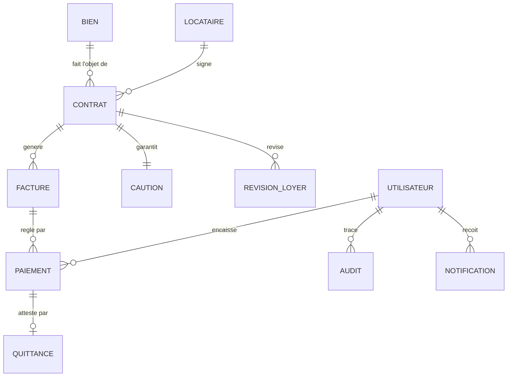

# Modèle de données — Base de travail

Point de départ issu du CDC (§19 + attributs collectés dans tout le document). À affiner et faire valider aux étapes 9–11. Conventions cibles : PostgreSQL, snake_case, tables au pluriel, PK `id` UUID, `created_at`/`updated_at` partout, montants en `NUMERIC(12,0)` (FCFA sans décimales).

## Entités principales (CDC §19)

| Entité | Rôle | Sections CDC sources |
|---|---|---|
| BIEN | Patrimoine immobilier | §5 |
| LOCATAIRE | Clients (physique/entreprise) | §6 |
| CONTRAT | Locations | §7 |
| FACTURE | Facturation mensuelle | §8 |
| PAIEMENT | Règlements | §9 |
| QUITTANCE | Reçus de paiement | §10 |
| CAUTION | Dépôts de garantie | §11 |
| DOCUMENT | Références documentaires (liens Drive) | §12 |
| UTILISATEUR | Accès et profils | §13 |
| NOTIFICATION | Centre de notifications | §17 |
| AUDIT | Traçabilité | §15 |
| REVISION_LOYER | Historique des révisions | §7.6 |

Tables de référence proposées (à valider) : `communes`, `quartiers`, `types_biens`, `modes_paiement`, `types_pieces_identite`.

## Relations (CDC §19.1 + déductions)

- Un BIEN a 0..N CONTRATS (1 seul actif à la fois — contrainte à modéliser).
- Un LOCATAIRE a 0..N CONTRATS.
- Un CONTRAT a 1..N FACTURES, exactement 1 CAUTION, 0..N REVISIONS_LOYER.
- Une FACTURE a 0..N PAIEMENTS (paiements partiels §9.2).
- Un PAIEMENT génère 0..1 QUITTANCE (après validation §10).
- Un DOCUMENT est associé à un BIEN, un LOCATAIRE, un CONTRAT ou une FACTURE (association polymorphe ou tables de liaison — à trancher étape 9).
- Un UTILISATEUR enregistre des PAIEMENTS, valide des opérations, reçoit des NOTIFICATIONS, apparaît dans AUDIT.

## Attributs clés par entité (collectés dans le CDC)

### biens (§5)
`code` (unique), `type`, `designation`, `description`, `commune`, `quartier`, `adresse`, `loyer`, `charges_mensuelles`, `statut` ∈ {libre, occupe, en_travaux}.

### locataires (§6)
`code` (unique), `type` ∈ {physique, entreprise}, `statut` ∈ {actif, archive}, `date_archivage` (purge auto à +1 an, RG-L04).
Physique : `civilite`, `nom`, `prenoms`, `date_naissance`, `nationalite`, `profession`.
Entreprise : `raison_sociale`, `infos_administratives`, `representant`.
Commun : `telephone_principal`, `telephone_secondaire`, `email`, `contact_urgence`.
Sous-entité `pieces_identite` : `type` ∈ {passeport, cni, carte_consulaire, permis}, `numero`, `date_expiration`.

### contrats (§7.2)
`numero` (unique), `bien_id`, `locataire_id`, `date_debut`, `date_fin`, `montant_loyer`, `charges`, `montant_caution`, `avance_loyer`, `periodicite` ∈ {mensuelle, trimestrielle, annuelle}, `statut` ∈ {brouillon, actif, resilie, termine}, `valide_par` (gérant), `date_validation`, `contrat_parent_id` (chaîne des renouvellements §7.3).

### factures (§8.3)
`numero` (unique), `contrat_id`, `date_emission`, `periode` (mois facturé), `montant_loyer`, `charges`, `arrieres`, `total_a_payer`, `montant_paye`, `solde_restant`, `statut` ∈ {emise, partiellement_payee, payee, impayee}, `date_echeance`.

### paiements (§9)
`reference` (unique), `facture_id`, `date_paiement`, `montant`, `mode` ∈ {especes, virement, cheque, orange_money, mtn_money, moov_money, wave}, `encaisse_par` (utilisateur), `statut` ∈ {valide, corrige, annule}.

### quittances (§10)
`numero` (unique), `paiement_id`, `date`, `lien_pdf`.

### cautions (§11)
`contrat_id` (1-1), `montant_initial`, `date_versement`, `statut` ∈ {detenue, remboursee, remboursee_avec_retenue}, `montant_retenu`, `motif_retenue`, `montant_rembourse`, `date_remboursement`, `valide_par`.

### documents (§12)
`type_document`, `reference`, `lien_securise`, `entite_type` + `entite_id` (association), `date_ajout`, `ajoute_par`.

### utilisateurs (§13)
`nom`, `email` (unique), `mot_de_passe_hash`, `profil` ∈ {administrateur, gerant, gestionnaire, consultation}, `actif`.

### notifications (§17.2)
`utilisateur_id`, `type` ∈ {information, alerte, action_requise}, `titre`, `message`, `lue`, `date`.

### audits (§15)
`utilisateur_id`, `date_heure`, `action`, `entite_type`, `entite_id`, `ancienne_valeur` (JSONB), `nouvelle_valeur` (JSONB).

### revisions_loyer (§7.6)
`contrat_id`, `ancien_montant`, `nouveau_montant`, `date_modification`, `motif`, `demande_par`, `valide_par`.

## Points à trancher au moment du MCD (étape 9)

1. Entité QUITTANCE distincte ou attributs du paiement ? (proposer : distincte, pour la numérotation légale).
2. Association DOCUMENT : polymorphe (`entite_type`/`entite_id`) ou 4 FK nullables ?
3. Tables de référence quartiers/communes gérées par l'admin ?
4. Arriérés : champ calculé sur la facture ou report dynamique ? (impact RG-F02).
5. Contrainte « un seul contrat actif par bien » : index partiel unique PostgreSQL `UNIQUE (bien_id) WHERE statut='actif'`.

## Gabarit Mermaid pour le MCD (étape 9)

