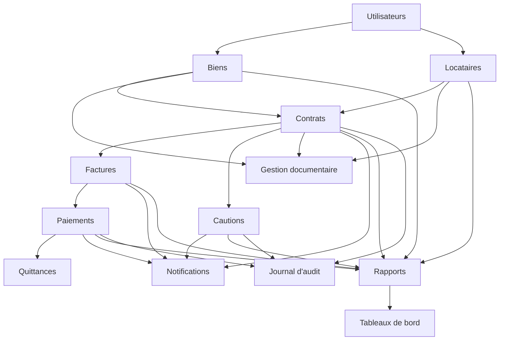

# 06. Analyse fonctionnelle

## 6.1 Décomposition fonctionnelle par module

### Gestion des biens
- Créer / modifier / consulter / archiver un bien
- Attribuer un code unique (auto ou manuel)
- Changer le statut (Libre, Occupé, En travaux)
- Consulter l'historique d'occupation d'un bien

### Gestion des locataires
- Créer / modifier / consulter une fiche locataire (personne physique ou entreprise)
- Enregistrer les pièces d'identité
- Consulter l'historique locatif
- Archiver un locataire sorti (purge automatique après 1 an)

### Gestion des contrats
- Créer un contrat (bien + locataire)
- Soumettre le contrat à validation du gérant
- Valider / activer un contrat (gérant)
- Générer le contrat en PDF
- Réviser un loyer (avec historique et validation)
- Suivre le renouvellement (tacite reconduction)
- Résilier / clôturer un contrat

### Gestion des factures
- Générer automatiquement les factures mensuelles (le 25)
- Générer une facture globale pour un contrat trimestriel/annuel
- Consulter / télécharger / envoyer une facture par email
- Suivre le solde restant dû

### Gestion des paiements
- Enregistrer un paiement (total ou partiel)
- Imputer un paiement sur la facture la plus ancienne due
- Corriger un paiement (avec validation du gérant)
- Générer automatiquement la quittance PDF

### Gestion des cautions
- Enregistrer une caution à la signature du contrat
- Suivre une caution pendant toute la durée du contrat
- Solder une caution au départ (remboursement ou retenue, avec motif)
- Valider la décision de retenue/remboursement (gérant)

### Gestion documentaire
- Rattacher un document (référence, type, lien Google Drive) à un bien, locataire, contrat ou élément financier
- Consulter la liste des documents rattachés à une fiche

### Notifications
- Émettre une notification interne (Information, Alerte, Action requise)
- Envoyer un email automatique (facture, échéance, impayé, renouvellement, rapport mensuel)
- Paramétrer les destinataires par type d'alerte

### Rapports
- Générer les rapports immobiliers, locataires, contrats, financiers, cautions
- Filtrer et exporter (PDF, Excel)

### Tableaux de bord
- Afficher les indicateurs clés (occupation, impayés, chiffre d'affaires, alertes)
- Afficher les graphiques obligatoires (CDC §16.9)

### Gestion des utilisateurs
- Créer / modifier / désactiver un compte utilisateur
- Attribuer un profil unique (Administrateur, Gérant, Gestionnaire locatif, Consultation)
- Réinitialiser un mot de passe

### Journal d'audit
- Tracer automatiquement chaque opération sensible (utilisateur, date, heure, action, ancienne/nouvelle valeur)
- Consulter le journal (Administrateur, Gérant)

## 6.2 Matrice fonctions × profils

Légende : **C** Création, **L** Lecture, **M** Modification, **S** Suppression/archivage, **V** Validation.

| Fonction | Administrateur | Gérant | Gestionnaire locatif | Consultation |
|---|---|---|---|---|
| Biens (CRUD) | C L M S | L | C L M | L |
| Locataires (CRUD) | C L M S | L | C L M | L |
| Contrats — création | L | L | C | L |
| Contrats — validation/activation | L | **V** | L | L |
| Révision de loyer | L | **V** | C (proposition) | L |
| Factures | L | L | C L | L |
| Paiements — saisie | L | L | C L | L |
| Paiements — correction | L | **V** | — (demande) | L |
| Cautions — suivi | L | L | C L M | L |
| Cautions — retenue/remboursement | L | **V** | — (proposition) | L |
| Documents | C L M S | L | C L M | L |
| Notifications | Paramétrage | L | L | L |
| Rapports | C L | L | L | L |
| Tableaux de bord | L | L | L | L |
| Utilisateurs | C L M S | — | — | — |
| Journal d'audit | L | L | — | — |

## 6.3 Dépendances entre modules

Les modules **Biens** et **Locataires** sont les fondations du système : un **Contrat** ne peut exister sans un bien et un locataire. La **Facturation** et les **Cautions** dépendent du contrat. Les **Paiements** dépendent des factures et génèrent les **Quittances**. Les **Notifications**, **Rapports** et **Tableaux de bord** consomment les données de tous les modules métier. Le **Journal d'audit** trace les opérations sensibles across tous les modules. La **Gestion des utilisateurs** est transverse et conditionne les droits d'accès à l'ensemble des modules.

## 6.4 Priorisation et découpage du développement

Conformément à la décision du client (D-022), **aucun découpage en lots fonctionnels n'est retenu : l'application est livrée en un seul bloc**, couvrant l'intégralité des 12 modules du périmètre V1 (CDC §3.1).

En interne, l'ordre de construction technique suivra néanmoins la logique des dépendances ci-dessus (Utilisateurs → Biens/Locataires → Contrats → Facturation/Paiements/Cautions → Documentaire/Notifications/Rapports/Tableaux de bord/Audit), sans que cela ne se traduise par une mise en service progressive côté agence.
