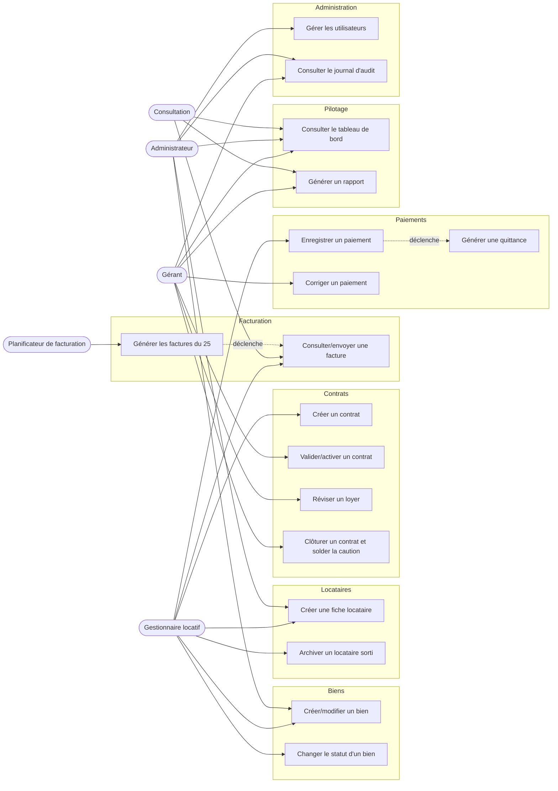

# 07. Cas d'utilisation

## 7.1 Diagramme général

## 7.2 Liste des cas d'utilisation par acteur

### Administrateur
- Gérer les utilisateurs (créer, modifier, désactiver un compte, attribuer un profil)
- Créer/modifier un bien, une fiche locataire (accès complet, usage ponctuel)
- Consulter le journal d'audit
- Consulter le tableau de bord

### Gérant
- Valider/activer un contrat
- Réviser un loyer (validation)
- Clôturer un contrat et solder la caution (décision de retenue/remboursement)
- Corriger un paiement (validation)
- Consulter les rapports et le tableau de bord
- Consulter le journal d'audit

### Gestionnaire locatif
- Créer/modifier un bien
- Créer une fiche locataire, archiver un locataire sorti
- Créer un contrat (soumis à validation du gérant)
- Consulter, télécharger et envoyer une facture
- Enregistrer un paiement (total ou partiel)

### Consultation (Comptable, Superviseur)
- Consulter les factures et données de loyers
- Consulter le tableau de bord
- Consulter les rapports

### Planificateur de facturation (acteur système)
- Générer automatiquement les factures du 25 pour les contrats actifs

## 7.3 Fiches détaillées

### UC-01 — Créer un bien

| | |
|---|---|
| Acteur | Gestionnaire locatif (Administrateur en complément) |
| Préconditions | L'utilisateur est authentifié avec un profil autorisé |
| Scénario nominal | 1. L'utilisateur saisit les informations du bien (type, description, commune, quartier, adresse, prix de location, charges mensuelles) → 2. Le système attribue un code unique → 3. Le bien est enregistré avec le statut « Libre » |
| Alternatives | Le code peut être saisi manuellement plutôt que généré automatiquement (RG-B01) |
| Exceptions | Champs obligatoires manquants → message d'erreur, saisie non enregistrée |
| Postconditions | Le bien apparaît dans la liste des biens disponibles, avec le statut « Libre » |

### UC-02 — Créer un locataire

| | |
|---|---|
| Acteur | Gestionnaire locatif (Administrateur en complément) |
| Préconditions | L'utilisateur est authentifié avec un profil autorisé |
| Scénario nominal | 1. L'utilisateur choisit le type (personne physique ou entreprise) → 2. Il saisit les informations d'identification et la pièce d'identité → 3. Le système attribue un code locataire → 4. La fiche est enregistrée |
| Alternatives | Type entreprise : saisie de la raison sociale, infos administratives, représentant (RG-L01) |
| Exceptions | Pièce d'identité expirée ou champs obligatoires manquants → blocage de l'enregistrement |
| Postconditions | Le locataire est disponible pour être associé à un contrat |

### UC-03 — Créer et valider un contrat

| | |
|---|---|
| Acteur | Gestionnaire locatif (création), Gérant (validation) |
| Préconditions | Le bien est « Libre » et le locataire existe |
| Scénario nominal | 1. Le gestionnaire crée le contrat (bien, locataire, dates, loyer, charges, caution, périodicité) → 2. Le contrat est soumis en attente de validation → 3. Le gérant examine et valide → 4. Le système active le contrat, passe le bien à « Occupé », génère le contrat PDF |
| Alternatives | Le gérant peut refuser la validation ; le contrat reste en attente pour correction |
| Exceptions | Bien déjà occupé au moment de la validation → refus système |
| Postconditions | Contrat actif (RG-C05), bien occupé, facturation possible |

### UC-04 — Générer les factures du 25

| | |
|---|---|
| Acteur | Planificateur de facturation (système) |
| Préconditions | Date du 25 du mois atteinte |
| Scénario nominal | 1. Le système recherche tous les contrats actifs → 2. Il calcule le montant dû par contrat (loyer + charges + arriérés éventuels) → 3. Il génère la facture (mois plein, sans prorata) → 4. Il produit le PDF → 5. Il notifie les acteurs concernés |
| Alternatives | Contrat en périodicité trimestrielle/annuelle : génération d'une facture globale unique pour la période (RG-F08), hors cycle mensuel standard |
| Exceptions | Contrat suspendu ou résilié entre-temps → exclu de la génération |
| Postconditions | Facture disponible, échéance fixée avant le 10 du mois suivant (RG-F05) |

### UC-05 — Enregistrer un paiement (total ou partiel)

| | |
|---|---|
| Acteur | Gestionnaire locatif |
| Préconditions | Une ou plusieurs factures sont dues pour le locataire |
| Scénario nominal | 1. Le gestionnaire sélectionne le locataire/la facture → 2. Il saisit le montant, le mode de paiement, la référence → 3. Le système impute le paiement sur la facture la plus ancienne due (RG-P06) → 4. Il met à jour le solde restant → 5. Il déclenche la génération de la quittance (UC-06) |
| Alternatives | Paiement partiel : la facture reste « partiellement payée », le solde reste dû |
| Exceptions | Montant saisi supérieur au solde total dû → alerte, confirmation requise |
| Postconditions | État de la facture mis à jour, quittance générée |

### UC-06 — Générer une quittance

| | |
|---|---|
| Acteur | Système (déclenché après UC-05) |
| Préconditions | Un paiement vient d'être validé |
| Scénario nominal | 1. Le système récupère les informations du paiement et du contrat → 2. Il génère la quittance PDF (logo, numéro, date, locataire, bien, période, montant, mode) → 3. Il la rend disponible au téléchargement/envoi |
| Alternatives | — |
| Exceptions | Échec de génération PDF → notification d'erreur à l'utilisateur |
| Postconditions | Quittance disponible et rattachée au paiement |

### UC-07 — Réviser un loyer

| | |
|---|---|
| Acteur | Gestionnaire locatif (proposition), Gérant (validation) |
| Préconditions | Contrat actif |
| Scénario nominal | 1. Le gestionnaire (ou le gérant) propose un nouveau montant de loyer avec motif → 2. Le gérant valide → 3. Le système historise (ancien montant, nouveau montant, date, motif, utilisateur) et applique le nouveau loyer aux prochaines factures |
| Alternatives | Le gérant peut initier directement la révision |
| Exceptions | Révision refusée → aucun changement, motif consigné |
| Postconditions | Historique de révision créé (RG-C07), loyer mis à jour |

### UC-08 — Clôturer un contrat et solder la caution

| | |
|---|---|
| Acteur | Gestionnaire locatif (constat de sortie), Gérant (validation) |
| Préconditions | Contrat actif, locataire en fin d'occupation |
| Scénario nominal | 1. Le gestionnaire initie la clôture du contrat → 2. Il renseigne les éventuels motifs de retenue sur la caution → 3. Le gérant valide la décision (remboursement intégral ou retenue) → 4. Le système clôture le contrat (statut « Terminé »), libère le bien (« Libre »), solde la caution, archive le locataire (historique conservé, données personnelles purgées après 1 an) |
| Alternatives | Résiliation anticipée : statut « Résilié » au lieu de « Terminé » |
| Exceptions | Litige sur le montant de retenue → clôture bloquée jusqu'à décision du gérant |
| Postconditions | Contrat clôturé, bien disponible, caution soldée (RG-K02, RG-K03) |

### UC-09 — Consulter le tableau de bord

| | |
|---|---|
| Acteur | Administrateur, Gérant, Gestionnaire locatif, Consultation |
| Préconditions | L'utilisateur est authentifié |
| Scénario nominal | 1. L'utilisateur accède au tableau de bord → 2. Le système affiche les indicateurs (occupation, impayés, chiffre d'affaires, alertes) et les graphiques obligatoires (CDC §16.9) selon le périmètre autorisé par son profil |
| Alternatives | Filtrage par période, par bien, par quartier |
| Exceptions | — |
| Postconditions | — (lecture seule) |
