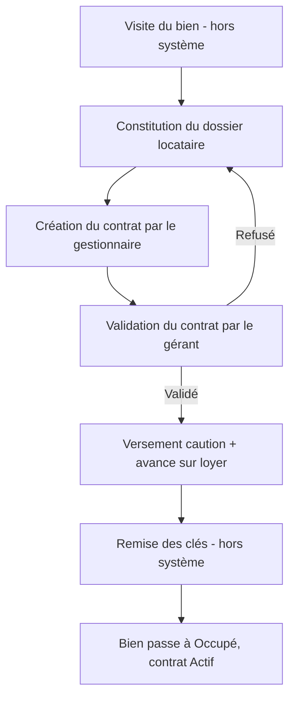
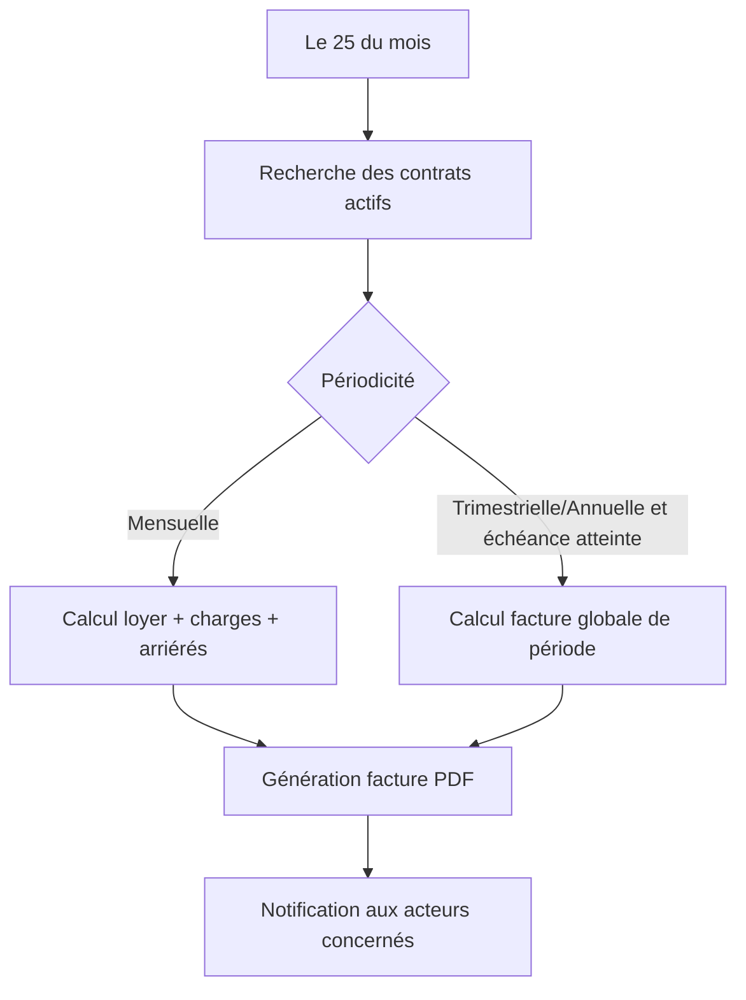
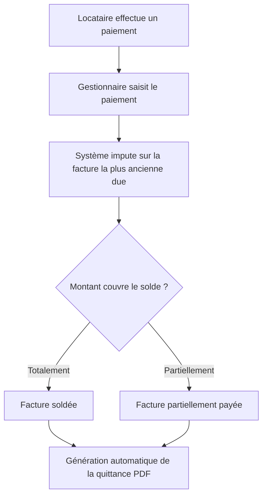
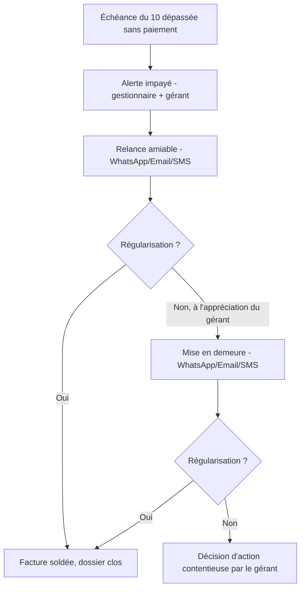
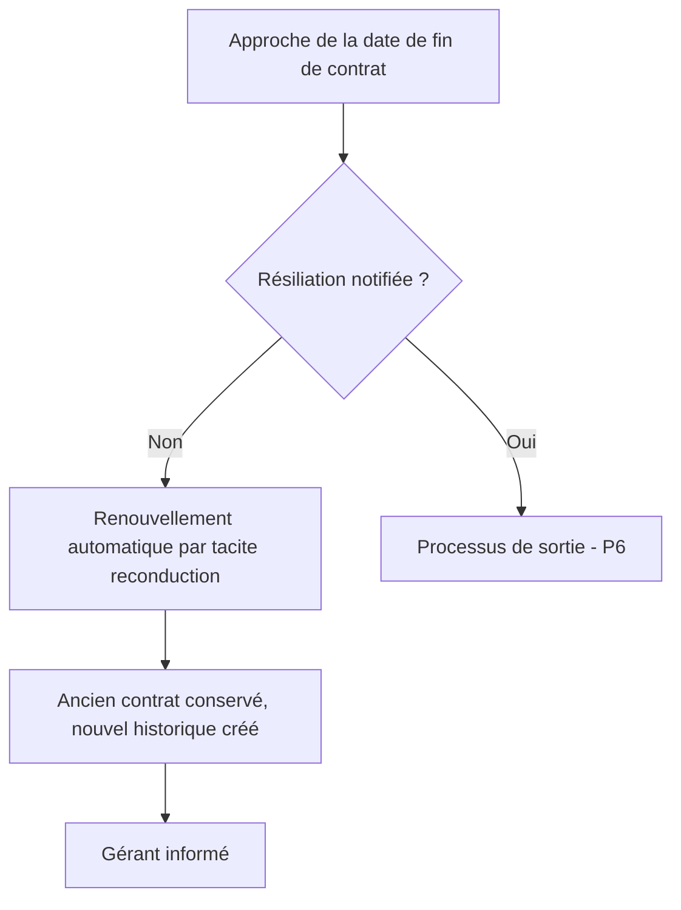
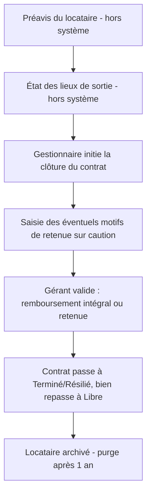
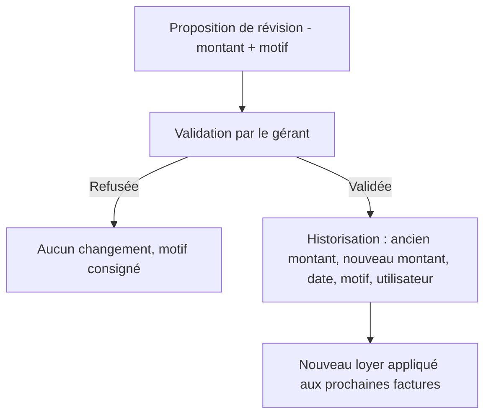

# 08. Processus métier

## P1 — Mise en location (entrée locataire)

La visite du bien se déroule hors système (CDC exclut la gestion des visites, §3.2). Le gestionnaire locatif constitue ensuite le dossier locataire (UC-02) puis crée le contrat (UC-03), soumis à validation du gérant (RG-C05). Après validation, la caution (RG-K01, RG-K04) et l'avance sur loyer éventuelle sont enregistrées, puis les clés sont remises au locataire (étape hors système). Le bien passe automatiquement au statut « Occupé » (RG-B05) et le contrat devient « Actif ».

## P2 — Cycle de facturation mensuel (le 25)

Le système (planificateur de facturation) recherche automatiquement tous les contrats actifs le 25 de chaque mois (RG-F01, RG-N03). Pour les contrats mensuels, il calcule le montant dû (mois plein, sans prorata — RG-F06) et génère la facture du mois suivant. Pour les contrats trimestriels/annuels arrivant à échéance de période, il génère une facture globale unique couvrant toute la période (RG-F08). Chaque facture est produite en PDF (RG-F04) et une notification est envoyée (UC-04).

## P3 — Encaissement et quittance

Le gestionnaire locatif enregistre le paiement (espèces, virement, chèque, Mobile Money — RG-P02), qui s'impute sur la facture la plus ancienne due (RG-P06). Le système met à jour l'état de la facture (payée, partiellement payée) et génère automatiquement la quittance PDF (RG-P05, UC-05, UC-06).

## P4 — Gestion des impayés

Après l'échéance du 10 du mois (RG-F05), le système déclenche une alerte impayé destinée au gestionnaire et au gérant (RG-N04). Une relance amiable est envoyée au locataire via **WhatsApp, email ou SMS** (D-026, D-027). Si la situation n'est pas régularisée, le gérant apprécie l'opportunité d'engager une mise en demeure, envoyée par les mêmes canaux. En l'absence de régularisation, **la décision d'engager une action contentieuse appartient exclusivement au gérant** — cette décision et son suivi se font hors système (au-delà de la mise en demeure).

## P5 — Renouvellement tacite

À l'approche de la date de fin, si aucune résiliation n'a été enregistrée, le système reconduit automatiquement le contrat par tacite reconduction (RG-C04, CDC §17.7). L'ancien contrat est conservé, un historique est créé, et le gérant en est informé.

## P6 — Sortie du locataire et caution

Le préavis et l'état des lieux de sortie sont **gérés hors système** (D-025) : l'application n'en assure ni la saisie ni le suivi. Le processus applicatif démarre à l'initiative du gestionnaire, qui déclenche la clôture du contrat (UC-08). Le gérant valide la décision sur la caution (remboursement intégral ou retenue motivée — RG-K02, RG-K03), sans délai imposé par le système (RG-K05). Le contrat passe à « Terminé » (ou « Résilié » en cas de résiliation anticipée), le bien redevient « Libre » (RG-B05 inversée), et le locataire est archivé — ses données personnelles étant purgées automatiquement après 1 an (RG-L04).

## P7 — Révision de loyer

Une révision de loyer peut être proposée en cours de contrat par le gestionnaire ou initiée directement par le gérant. Toute révision nécessite la validation du gérant et est historisée (RG-C07, UC-07). Le nouveau montant s'applique aux factures générées à partir du cycle suivant (P2).
