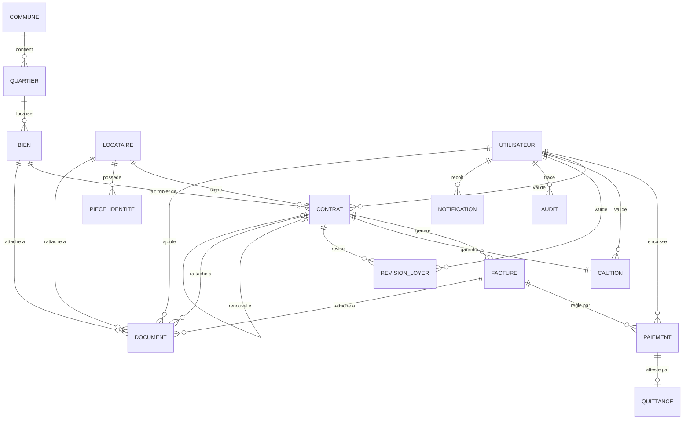

# 09. Modèle conceptuel de données (MCD)

## 9.1 Diagramme entité-association

## 9.2 Description des entités

### COMMUNE / QUARTIER
Tables de référence gérables par l'administrateur (D-029). Une commune contient plusieurs quartiers. Un bien est localisé dans un quartier (qui détermine sa commune). Permet d'accompagner le développement du patrimoine sans modification de code (nouveaux quartiers ajoutables par paramétrage).

### BIEN
Le patrimoine immobilier propre de l'agence (aucune entité PROPRIÉTAIRE distincte — l'agence CIMEC est l'unique propriétaire, D-028). Identifié par un code unique, localisé dans un quartier, caractérisé par un type, une description, un loyer, des charges et un statut (Libre, Occupé, En travaux — RG-B03).

### LOCATAIRE
Personne physique ou entreprise (RG-L01). Possède une ou plusieurs pièces d'identité (PIECE_IDENTITE). Peut signer plusieurs contrats au fil du temps (historique locatif, RG-L05). Archivé à son départ, avec purge automatique des données personnelles après 1 an (RG-L04).

### PIECE_IDENTITE
Sous-entité de LOCATAIRE : type (passeport, CNI, carte consulaire, permis), numéro, date d'expiration (RG-L03).

### CONTRAT
Lie obligatoirement un bien et un locataire (RG-C01). Porte les conditions financières et la périodicité. Un contrat peut renouveler un contrat antérieur (auto-association, chaîne de renouvellements par tacite reconduction — RG-C04). **Règle de gestion portée par le modèle : un bien ne peut avoir qu'un seul contrat au statut « actif » à la fois** (contrainte d'unicité à implémenter au niveau base de données, cf. section 10).

### CAUTION
Associée à un contrat en relation 1-1 (un contrat a exactement une caution — RG-K01). Conserve le montant initial, son statut (détenue, remboursée, remboursée avec retenue) et les informations de solde (RG-K02, RG-K03, RG-K04).

### REVISION_LOYER
Historique des révisions de loyer d'un contrat : ancien montant, nouveau montant, date, motif, demandeur, validateur (RG-C07).

### FACTURE
Générée pour un contrat (mensuelle ou globale pour les périodicités trimestrielle/annuelle — RG-F08). Conserve le détail des montants (loyer, charges, arriérés, total, payé, solde) et son statut (RG-F02).

### PAIEMENT
Réglement d'une facture, total ou partiel (RG-P01). Une facture peut recevoir plusieurs paiements jusqu'à solde. Encaissé par un utilisateur (RG-P03).

### QUITTANCE
Entité distincte (D-030), générée automatiquement après un paiement, avec sa propre numérotation (RG-P05).

### DOCUMENT
Référence à un document stocké sur Google Drive (lien sécurisé, pas de fichier stocké en base — RG-D01). Rattaché à un bien, un locataire, un contrat ou une facture (RG-D02). Modélisé par une **association polymorphe** (`entite_type` + `entite_id`), pour rester extensible sans multiplier les clés étrangères nullables ; l'intégrité référentielle est contrôlée au niveau applicatif.

### UTILISATEUR
Compte d'accès avec un profil unique parmi les quatre définis (RG-U01). Intervient comme encaisseur de paiement, validateur (contrat, révision, caution), auteur d'action tracée en audit, destinataire de notification.

### NOTIFICATION
Message adressé à un utilisateur (Information, Alerte, Action requise — RG-N01).

### AUDIT
Trace toute opération sensible : utilisateur, date, heure, action, entité concernée, ancienne et nouvelle valeur (RG-U03).

## 9.3 Cardinalités justifiées

| Relation | Cardinalité | Justification |
|---|---|---|
| COMMUNE — QUARTIER | 1,N | Une commune regroupe plusieurs quartiers (D-029) |
| QUARTIER — BIEN | 1,N | Un quartier peut localiser plusieurs biens |
| BIEN — CONTRAT | 0,N | Un bien peut avoir eu 0 à N contrats dans le temps ; au plus 1 actif à la fois |
| LOCATAIRE — CONTRAT | 0,N | Historique locatif (RG-L05) |
| LOCATAIRE — PIECE_IDENTITE | 1,N | Au moins une pièce d'identité requise à la création (RG-L03) |
| CONTRAT — FACTURE | 0,N | Un contrat génère une facture par cycle (RG-F01, RG-F08) |
| CONTRAT — CAUTION | 1,1 | Caution exigée à la signature (RG-K01) |
| CONTRAT — REVISION_LOYER | 0,N | Révisions possibles en cours de contrat (RG-C07) |
| CONTRAT — CONTRAT (renouvellement) | 0,1 | Un contrat peut être issu du renouvellement d'un contrat antérieur (RG-C04) |
| FACTURE — PAIEMENT | 0,N | Paiements partiels multiples possibles (RG-P01) |
| PAIEMENT — QUITTANCE | 0,1 | Une quittance par paiement validé (RG-P05) |
| DOCUMENT — (BIEN\|LOCATAIRE\|CONTRAT\|FACTURE) | 0,N chacun | Association polymorphe (RG-D02) |
