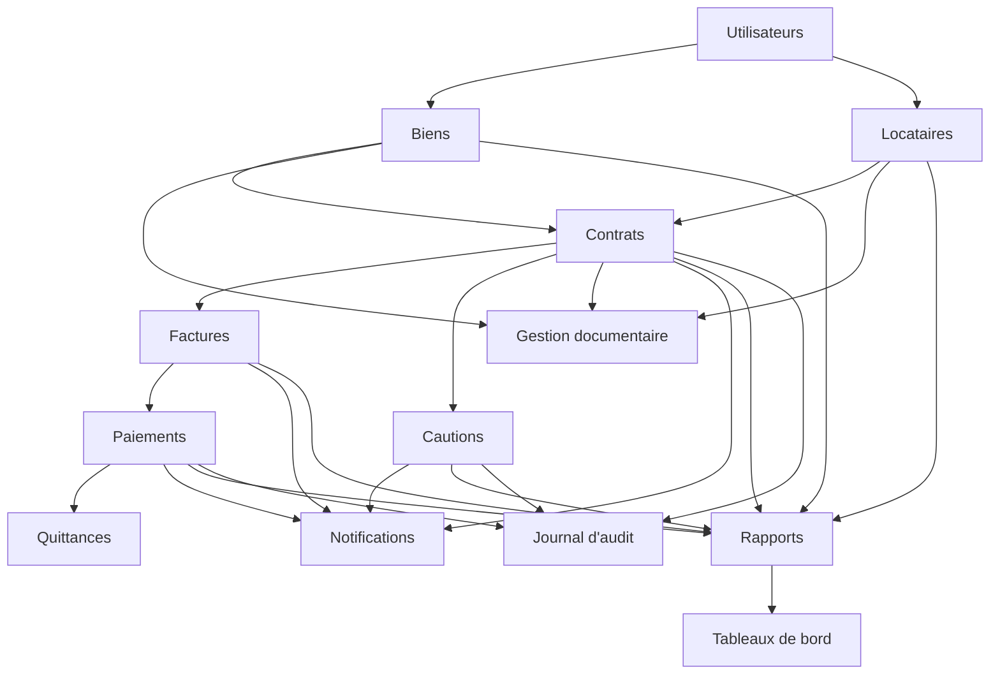
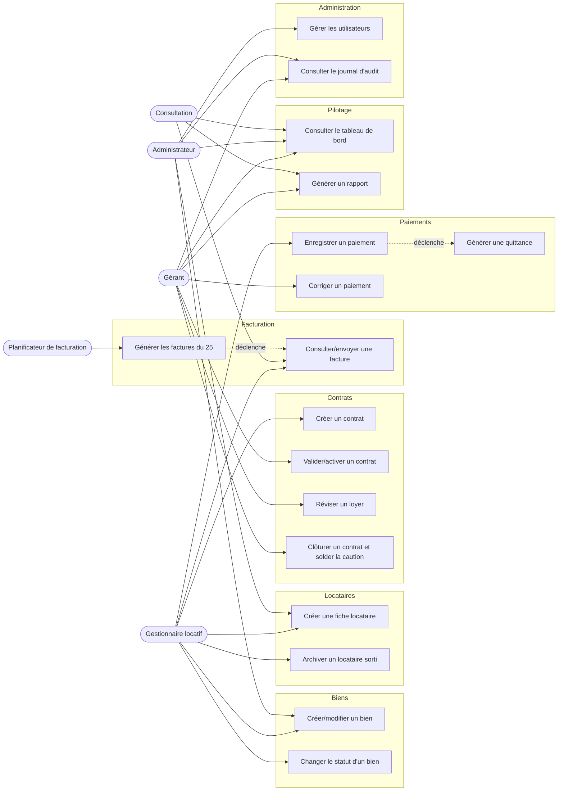
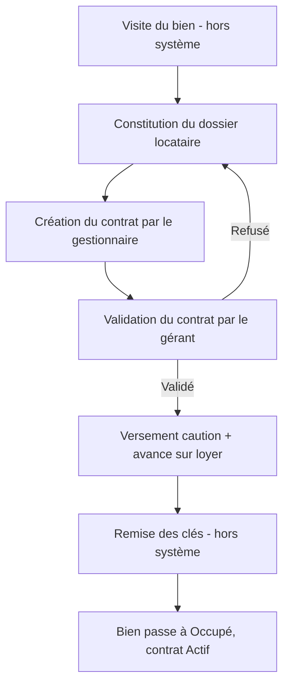
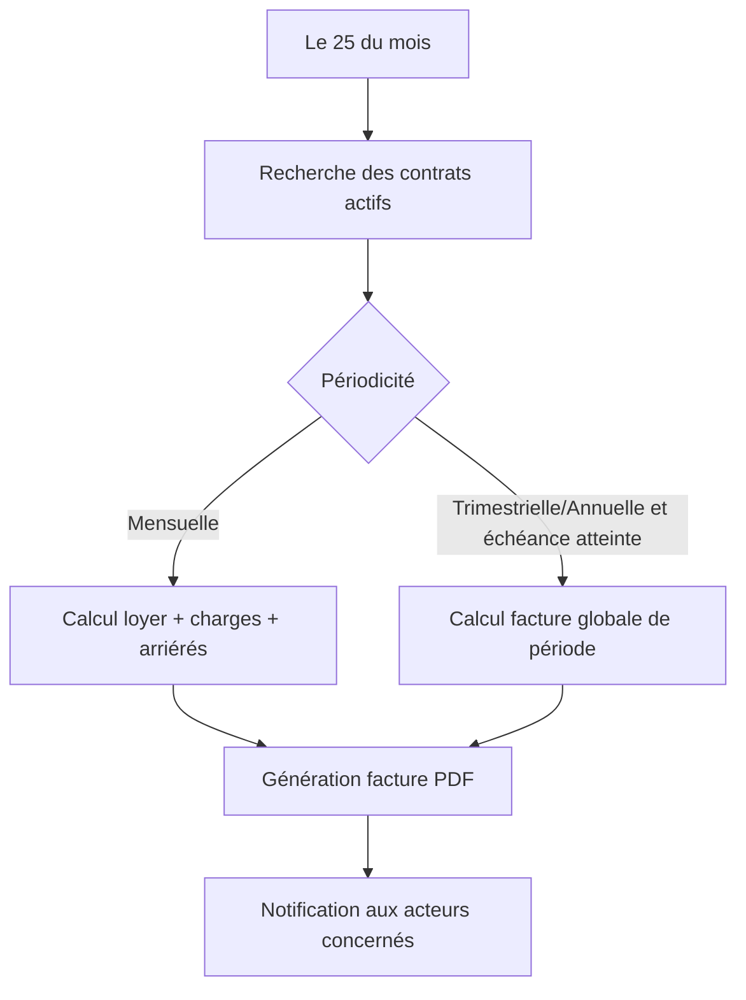
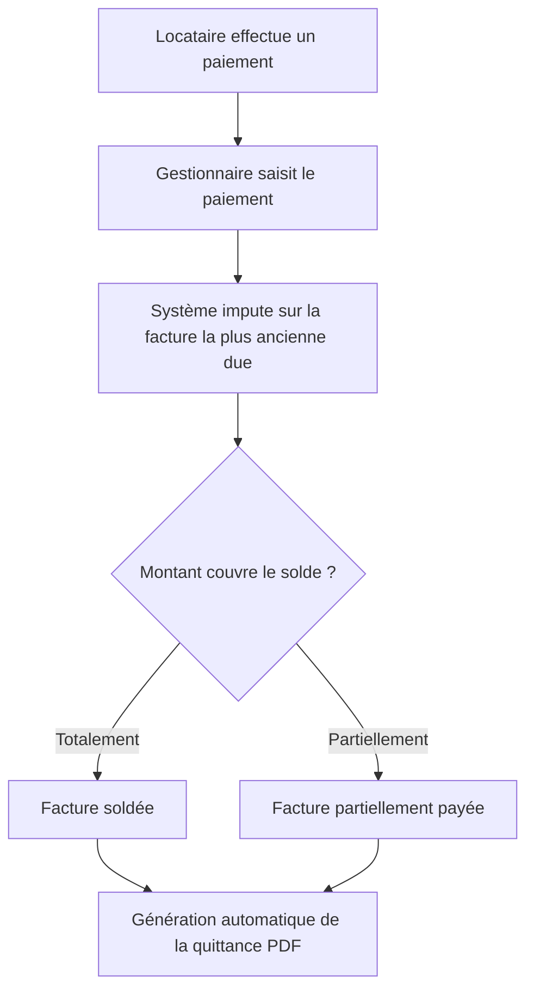
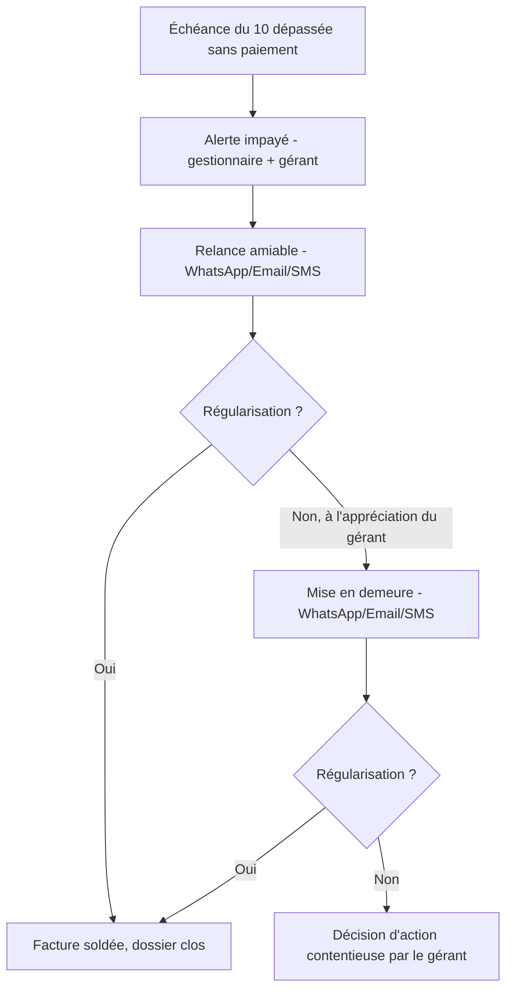
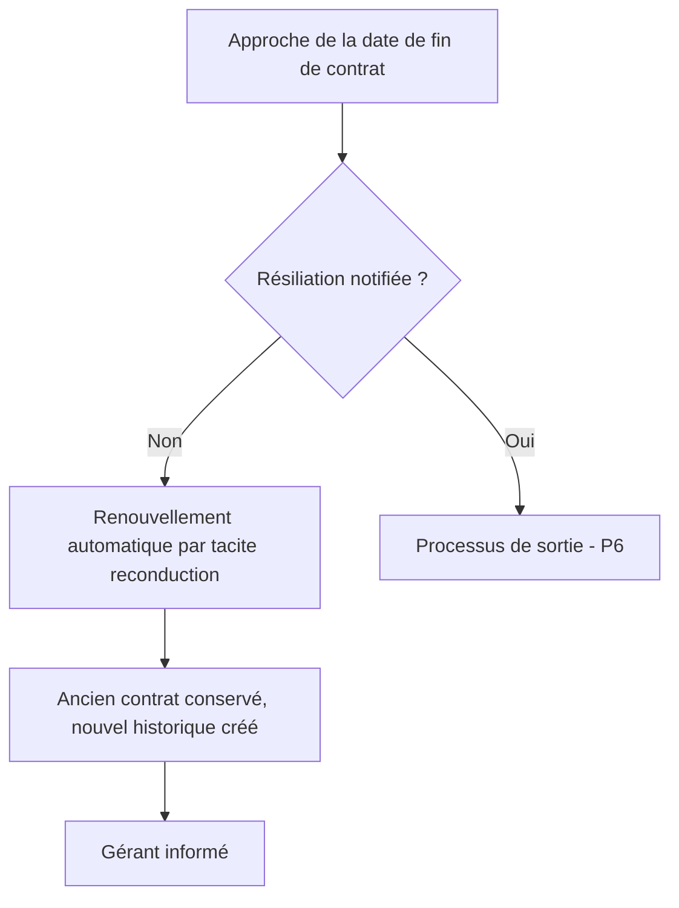
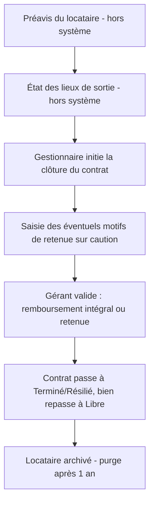
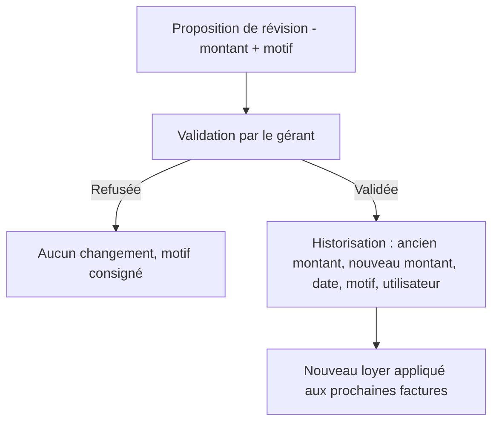
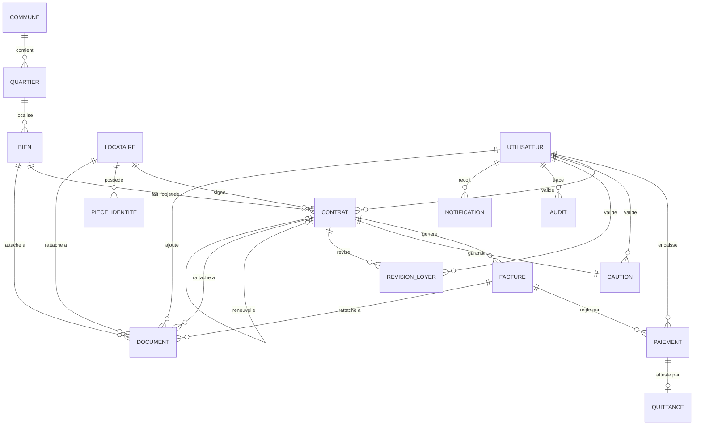

# DOSSIER DE CONCEPTION

## Application de Gestion Locative

### Agence CISSE MEDOUNE (CIMEC)

---

| | |
|---|---|
| **Client** | CISSE MEDOUNE (CIMEC) SARL |
| **Adresse** | Treichville, Zone III, Abidjan, Côte d'Ivoire |
| **Projet** | Application web de gestion locative immobilière |
| **Version** | 1.0 |
| **Date** | 31/07/2026 |
| **Statut** | Dossier validé — 16/16 sections |
| **Référence** | Cahier des charges v1.0 (juillet 2026) |

---

## Sommaire

1. [Présentation de l'agence](#01-presentation-agence)
2. [Contexte et objectifs](#02-contexte-objectifs)
3. [Analyse des besoins](#03-analyse-besoins)
4. [Acteurs du système](#04-acteurs)
5. [Règles de gestion](#05-regles-gestion)
6. [Analyse fonctionnelle](#06-analyse-fonctionnelle)
7. [Cas d'utilisation](#07-cas-utilisation)
8. [Processus métier](#08-processus-metier)
9. [Modèle conceptuel de données (MCD)](#09-mcd)
10. [Modèle logique de données (MLD)](#10-mld)
11. [Dictionnaire des données](#11-dictionnaire-donnees)
12. [Interfaces de l'application](#12-interfaces)
13. [États et rapports](#13-etats-rapports)
14. [Sécurité et profils utilisateurs](#14-securite-profils)
15. [Cahier des charges fonctionnel](#15-cdcf)
16. [Évolutions futures](#16-evolutions-futures)

Annexe — [Journal des décisions](#00-journal-decisions)

---


<a id="01-presentation-agence"></a>

# 01. Présentation de l'agence

## 1.1 Identité de l'agence

| Élément | Valeur |
|---|---|
| Raison sociale | CISSE MEDOUNE (CIMEC) |
| Forme juridique | SARL |
| Capital social | 1 000 000 FCFA |
| Date de création | 2000 |
| Adresse du siège | Treichville, Zone III, Abidjan, Côte d'Ivoire |
| Téléphone | +225 01 03 98 95 50 |
| Email | cimec@gmail.com |
| Effectif | 5 personnes |

## 1.2 Activité et patrimoine

CIMEC est une agence de gestion locative immobilière qui gère **son propre patrimoine** (biens non meublés dont elle est l'unique propriétaire), et non des biens de tiers. Le patrimoine géré comprend environ **70 biens**, répartis dans plusieurs quartiers d'Abidjan (notamment Treichville, Zone IV, Zone III), toutes catégories confondues : maisons, villas, appartements, studios, chambres, bureaux, magasins, entrepôts, terrains, immeubles et locaux commerciaux.

## 1.3 Organisation interne

L'effectif de 5 personnes se répartit selon les postes suivants :

| Poste | Rôle actuel |
|---|---|
| Administrateur | Pilotage général, paramétrage |
| Gérant | Validations (contrats, révisions de loyers, cautions, corrections de paiements), suivi financier |
| Gestionnaire actif | Gestion opérationnelle des biens, locataires, contrats, factures, paiements |
| Comptable | Suivi comptable et financier |
| Superviseur | Supervision de l'activité |

Cette organisation constitue la base des profils utilisateurs de l'application (cf. CDC §13 et section 04 — Acteurs du système).

## 1.4 Positionnement du projet

L'application de gestion locative vient outiller cette organisation existante pour fiabiliser et automatiser les processus aujourd'hui réalisés manuellement (cf. section 02 — Contexte et objectifs).

---

<a id="02-contexte-objectifs"></a>

# 02. Contexte et objectifs

## 2.1 Contexte

L'agence immobilière **CISSE MEDOUNE (CIMEC)** assure la gestion locative de son propre patrimoine immobilier, composé de plusieurs catégories de biens non meublés : maisons, villas, appartements, studios, chambres, bureaux, magasins, entrepôts, terrains, immeubles et locaux commerciaux. Ces biens sont répartis principalement dans différents quartiers d'Abidjan, notamment Treichville, Zone IV et Zone III, ce périmètre étant amené à évoluer avec le développement du patrimoine (CDC §1.1).

Aujourd'hui, la gestion s'appuie sur une **application Access locale** installée sur PC, complétée par un **registre** tenu en parallèle. Cette organisation limite l'accessibilité (poste unique, pas d'accès distant), l'ergonomie et la sécurité des données, et ne permet pas un pilotage fin de l'activité.

## 2.2 Problématique

La gestion locative nécessite un suivi rigoureux de plusieurs domaines : disponibilité des biens, contrats de location, échéances, facturation mensuelle, paiements, impayés, cautions, historique des locataires et reporting financier (CDC §1.2).

L'outil actuel (Access + registre papier) ne répond plus à ces exigences : accessibilité restreinte à un seul poste, ergonomie datée, sécurité limitée (pas de gestion fine des droits, pas de sauvegarde automatisée), absence de tableaux de bord fiables, suivi des relances d'impayés peu structuré, et digitalisation incomplète des processus.

Afin d'améliorer son efficacité opérationnelle, CIMEC souhaite disposer d'une solution informatique centralisée permettant d'automatiser et sécuriser l'ensemble du processus de gestion locative (CDC §1.2).

## 2.3 Objectif général

Développer une application web professionnelle permettant à l'agence CISSE MEDOUNE de gérer intégralement son patrimoine locatif depuis une plateforme unique, accessible sur ordinateur, tablette et smartphone (CDC §1.3).

## 2.4 Objectifs spécifiques

### Gestion immobilière
- Enregistrer tous les biens ;
- Identifier chaque bien par un code unique ;
- Suivre leur disponibilité ;
- Conserver l'historique des occupations.

### Gestion locataires
- Créer une fiche complète locataire ;
- Gérer personnes physiques et entreprises ;
- Conserver l'historique locatif ;
- Archiver temporairement les anciens locataires.

### Gestion contractuelle
- Créer les contrats ;
- Générer les contrats en PDF ;
- Suivre les renouvellements ;
- Historiser les révisions de loyers.

### Gestion financière
- Générer automatiquement les factures ;
- Enregistrer les paiements, y compris partiels ;
- Produire les quittances ;
- Suivre les impayés.

### Pilotage
- Fournir des tableaux de bord ;
- Générer des rapports ;
- Faciliter les décisions du gérant.

*(CDC §2)*

## 2.5 Indicateurs de succès attendus

La réussite du projet sera mesurée par l'agence à travers :

- une **accessibilité étendue** de l'outil (au-delà du poste unique actuel) ;
- une **meilleure ergonomie** et une **sécurité renforcée** des données ;
- des **tableaux de bord plus précis et conviviaux** pour le pilotage de l'activité ;
- une **amélioration des encaissements** (suivi et taux de recouvrement) ;
- une **gestion structurée des rappels** (relances d'impayés) ;
- une **digitalisation plus poussée** de l'ensemble des processus de gestion locative.

## 2.6 Échéance de mise en production

Non déterminée à ce stade. Ce point sera précisé ultérieurement par l'agence et pourra être affiné après validation du dossier de conception, notamment en fonction du découpage en lots proposé à l'étape 6 (Analyse fonctionnelle).

---

<a id="03-analyse-besoins"></a>

# 03. Analyse des besoins

## 3.1 Besoins fonctionnels par module

Le système devra intégrer les 12 modules suivants (CDC §3.1) :

| Module | Besoin |
|---|---|
| Gestion des biens | Enregistrer, identifier (code unique), localiser, suivre la disponibilité et l'historique d'occupation des 70 biens du patrimoine |
| Gestion des locataires | Créer une fiche complète (personne physique ou entreprise), suivre l'historique locatif, archiver les anciens locataires |
| Gestion des contrats | Créer, générer en PDF, suivre les renouvellements, historiser les révisions de loyer |
| Gestion des factures | Générer automatiquement les factures mensuelles (~80 à 90 factures/mois) |
| Gestion des paiements | Enregistrer les paiements totaux et partiels, suivre les impayés |
| Gestion des cautions | Suivre les dépôts de garantie sur toute la durée du contrat, jusqu'au solde de départ |
| Gestion documentaire | Référencer les documents (contrats, pièces d'identité, etc.) stockés sur Google Drive |
| Notifications | Alertes échéances, impayés, contrats, cautions |
| Rapports | Rapports financiers et d'activité, filtrables |
| Tableaux de bord | Vue de pilotage pour le gérant et l'administrateur |
| Gestion des utilisateurs | Comptes, profils, droits d'accès |
| Journal d'audit | Traçabilité des actions sensibles |

## 3.2 Besoins non fonctionnels

### Volumétrie estimée
- **70 biens** au patrimoine ;
- **70 locataires actifs** ;
- **80 à 90 factures émises par mois** ;
- **5 utilisateurs connectés simultanément** (à dimensionner avec une marge raisonnable).

### Performance
Le système doit rester réactif avec la volumétrie ci-dessus et une charge de 5 utilisateurs simultanés, sans dégradation perceptible du temps de réponse sur les opérations courantes (consultation, saisie, génération de facture/quittance).

### Sécurité
HTTPS obligatoire, droits d'accès par profil, mots de passe chiffrés (hash), sauvegardes automatiques, journal d'audit (cf. section 14 — Sécurité et profils, CDC §18).

### Disponibilité
Hébergement sur VPS Linux Ubuntu (4 Go RAM minimum, SSD) avec sauvegardes automatiques régulières, permettant une continuité de service adaptée à un usage professionnel quotidien.

### Ergonomie et mobilité
Application web responsive, utilisable sans réserve sur ordinateur, tablette et smartphone (CDC §4.1, §18.1), avec une ergonomie améliorée par rapport à l'outil Access actuel (cf. section 02).

### Reprise de données
Import initial des données existantes (biens, locataires, contrats en cours) **via fichiers Excel**, au démarrage de l'application. Ce besoin implique la préparation de modèles de fichiers d'import et d'un contrôle de cohérence à la reprise (à détailler en phase de développement).

### Connectivité
Application accessible **en ligne (web)** — c'est le mode d'usage prioritaire pour la V1. Un usage hors-ligne est souhaité par l'agence mais n'est pas requis pour la V1 ; il est reporté en piste d'évolution future (cf. section 16 — Évolutions futures).

## 3.3 Exclusions V1

Conformément au CDC §3.2, ne sont pas prévus dans la première version :
- Gestion des visites immobilières ;
- Gestion des photos des biens ;
- Signature électronique ;
- Gestion multi-agences ;
- Gestion de biens appartenant à des tiers.

À ces exclusions s'ajoute, suite à l'analyse des besoins :
- **Usage hors-ligne** (reporté en évolution future, cf. section 16).

## 3.4 Contraintes

- Développement sur mesure, code source, base de données et documentation propriété de l'agence (CDC §4.2) ;
- Base de données PostgreSQL, hébergement VPS Linux Ubuntu, HTTPS obligatoire (CLAUDE.md) ;
- Devise FCFA (XOF), sans décimales dans les montants courants ;
- Langue unique : français ;
- Documents stockés sur Google Drive professionnel — l'application ne conserve que la référence, le type et le lien sécurisé ;
- **Intégration WhatsApp Business API** pour les relances impayés — extension de périmètre par rapport au CDC initial, qui classait WhatsApp en évolution future (D-027 ; cf. section 08, section 16).

---

<a id="04-acteurs"></a>

# 04. Acteurs du système

## 4.1 Acteurs humains

Le système gère **quatre profils** (CDC §13.1). Chaque compte utilisateur porte **un seul profil** (pas de cumul, D-013). Le locataire n'est **pas** un acteur direct du système en V1 — l'accès locataire (portail) est une évolution future (CDC §3.2, §22 ; section 16).

### Administrateur

| | |
|---|---|
| Effectif actuel | 1 personne |
| Responsabilités | Gestion complète de l'application, paramétrage, gestion des utilisateurs, sécurité (CDC §13.1) |
| Fréquence d'usage | Ponctuelle (paramétrage, administration des comptes) |

### Gérant

| | |
|---|---|
| Effectif actuel | 1 personne |
| Responsabilités | Validation des opérations sensibles (activation de contrat, révision de loyer, retenue et remboursement de caution, correction de paiement), consultation des états financiers et rapports (CDC §13.1, §14) |
| Fréquence d'usage | Régulière (validations, suivi financier) |

### Gestionnaire locatif

| | |
|---|---|
| Effectif actuel | 1 personne (Gestionnaire actif) |
| Responsabilités | Gestion opérationnelle : biens, locataires, contrats, factures, paiements (CDC §13.1) |
| Fréquence d'usage | Quotidienne — utilisateur principal de l'application |

### Consultation

| | |
|---|---|
| Effectif actuel | 2 personnes (Comptable, Superviseur) |
| Responsabilités | Lecture seule (CDC §13.1) ; accès aux données de loyers pour le Comptable et le Superviseur (D-006) |
| Fréquence d'usage | Régulière (suivi comptable et supervision) |

## 4.2 Acteurs systèmes

| Acteur système | Rôle |
|---|---|
| Planificateur de facturation | Génère automatiquement les factures mensuelles à date fixe (CDC §17.4) |
| Service de notifications / email | Envoie les alertes échéances, impayés, contrats, cautions et les notifications par email (CDC §17.2, §17.3) |
| Google Drive | Stockage des documents ; l'application ne conserve que la référence, le type et le lien sécurisé (CLAUDE.md, CDC §12) |

## 4.3 Matrice acteurs × modules

| Module | Administrateur | Gérant | Gestionnaire locatif | Consultation |
|---|---|---|---|---|
| Biens | Gestion complète | Consultation | Gestion | Lecture |
| Locataires | Gestion complète | Consultation | Gestion | Lecture |
| Contrats | Gestion complète | Validation | Gestion (création) | Lecture |
| Factures | Gestion complète | Consultation | Gestion | Lecture |
| Paiements | Gestion complète | Validation (corrections) | Gestion | Lecture |
| Cautions | Gestion complète | Validation (retenue/remboursement) | Gestion (suivi) | Lecture |
| Gestion documentaire | Gestion complète | Consultation | Gestion | Lecture |
| Notifications | Paramétrage | Réception | Réception | Réception (selon périmètre) |
| Rapports | Gestion complète | Consultation | Consultation | Lecture |
| Tableaux de bord | Consultation | Consultation | Consultation | Lecture |
| Utilisateurs | Gestion complète | — | — | — |
| Journal d'audit | Consultation | Consultation | — | — |

*Cette matrice sera affinée à l'étape 6 (Analyse fonctionnelle) et à l'étape 14 (Sécurité et profils) avec le détail CRUD par fonction.*

---

<a id="05-regles-gestion"></a>

# 05. Règles de gestion

Chaque règle cite sa source : référence au cahier des charges (CDC §) ou décision du journal (D-XXX).

## 5.1 Biens

| Réf. | Règle | Source |
|---|---|---|
| RG-B01 | Chaque bien possède un code unique (généré automatiquement ou saisi manuellement) | CDC §5.1 |
| RG-B02 | Types de biens : maison, villa, appartement, studio, chambre, bureau, magasin, entrepôt, terrain, immeuble, local commercial | CDC §1.1 |
| RG-B03 | Statuts d'un bien : Libre, Occupé, En travaux | CDC §5.2 |
| RG-B04 | Champs obligatoires : code, type, description, commune, quartier, adresse, prix de location, charges mensuelles | CDC §5.3 |
| RG-B05 | Un bien passe automatiquement à « Occupé » à la validation d'un contrat | CDC §7.4 |
| RG-B06 | Tous les biens sont non meublés et appartiennent à l'agence (pas de biens de tiers) | CDC §1.1, §3.2 |
| RG-B07 | L'historique des occupations d'un bien est conservé | CDC §2, §16.3 |

## 5.2 Locataires

| Réf. | Règle | Source |
|---|---|---|
| RG-L01 | Deux types : personne physique (civilité, nom, prénoms, date de naissance, nationalité, profession) et entreprise (raison sociale, infos administratives, représentant) | CDC §6.1 |
| RG-L02 | Identification : code locataire, téléphone principal, téléphone secondaire, email, contact d'urgence | CDC §6.2 |
| RG-L03 | Pièces d'identité acceptées : passeport, CNI, carte consulaire, permis de conduire — avec type, numéro, date d'expiration | CDC §6.3 |
| RG-L04 | Au départ d'un locataire : historique conservé ; données personnelles archivées 1 an puis suppression automatique | CDC §6.4 |
| RG-L05 | L'historique locatif (logements, contrats, paiements, incidents) est consultable | CDC §16.4 |

## 5.3 Contrats

| Réf. | Règle | Source |
|---|---|---|
| RG-C01 | Un contrat lie obligatoirement un bien et un locataire | CDC §7.2 |
| RG-C02 | Champs : numéro unique, bien, locataire, date début, date fin, loyer, charges, caution, avance sur loyer (optionnelle), périodicité (mensuelle/trimestrielle/annuelle), statut | CDC §7.2 |
| RG-C03 | Statuts : Actif, Résilié, Terminé | CDC §7.2 |
| RG-C04 | Durée standard : 1 an, renouvelable par tacite reconduction ; le renouvellement est automatique, l'ancien contrat est conservé, l'historique créé, le gérant informé | CDC §7.3, §17.7 |
| RG-C05 | Création par le gestionnaire locatif ; validation finale par le gérant. Après validation : contrat actif, bien « Occupé », facturation possible | CDC §7.4 |
| RG-C06 | Génération automatique du contrat PDF (logo, coordonnées agence, bailleur, locataire, bien, conditions financières, durée, clauses, zones de signature). Deux trames selon le type de locataire : bail habitation (personne physique) ou bail commercial (entreprise) | CDC §7.5, D-035 |
| RG-C07 | Révision de loyer possible en cours de contrat, avec historique obligatoire : ancien montant, nouveau montant, date, motif, utilisateur, validation du gérant | CDC §7.6 |

## 5.4 Facturation

| Réf. | Règle | Source |
|---|---|---|
| RG-F01 | Facturation mensuelle, générée automatiquement le 25 de chaque mois pour les contrats actifs, au titre du mois suivant | CDC §8.1 |
| RG-F02 | Contenu obligatoire : numéro unique, date d'émission, période, locataire, bien, loyer, charges, arriérés, total à payer, montant payé, solde restant | CDC §8.3 |
| RG-F03 | Périodicités gérées : mensuelle, trimestrielle, annuelle — option par locataire/contrat | CDC §8.4 |
| RG-F04 | La facture PDF est consultable, téléchargeable et envoyable par email | CDC §8.5 |
| RG-F05 | Échéance de paiement : avant le 10 du mois | CDC §17.5, D-020 |
| RG-F06 | Pas de prorata pour le premier mois de location : le mois d'entrée est facturé en mois plein, quelle que soit la date d'entrée | D-015 |
| RG-F07 | Aucune pénalité de retard en V1 | D-019 |
| RG-F08 | Pour les contrats en périodicité trimestrielle ou annuelle : une **facture globale unique** est émise pour toute la période (loyers cumulés), payée d'avance — pas de factures mensuelles séparées | D-021 |

## 5.5 Paiements

| Réf. | Règle | Source |
|---|---|---|
| RG-P01 | Une facture peut être réglée en totalité, partiellement ou en plusieurs versements ; le système calcule montant payé, reste à payer, état de la facture | CDC §9.2 |
| RG-P02 | Moyens acceptés : espèces, virement bancaire, chèque, Orange Money, MTN Money, Moov Money, Wave | CDC §9.3 |
| RG-P03 | Chaque transaction conserve : référence, date, montant, mode, utilisateur encaisseur, facture associée | CDC §9.4, §9.5 |
| RG-P04 | La correction d'un paiement nécessite la validation du gérant | CDC §14 |
| RG-P05 | Après validation d'un paiement : génération automatique d'une quittance PDF (logo, numéro, date, locataire, bien, période, montant, mode) | CDC §10 |
| RG-P06 | Quand un locataire a plusieurs factures dues, un paiement s'impute d'abord sur la facture la plus ancienne | D-018 |

## 5.6 Cautions

| Réf. | Règle | Source |
|---|---|---|
| RG-K01 | Caution exigée à la signature ; enregistrée avec montant initial, date de versement, contrat associé | CDC §11.1, §11.2 |
| RG-K02 | À la sortie : remboursement intégral OU avec retenue (motifs : dommages, réparations, sommes dues) | CDC §11.3 |
| RG-K03 | Décision et validation par le gérant ; conservation de : montant retenu, motif, montant remboursé, date, validateur | CDC §11.4 |
| RG-K04 | Montant standard de la caution : **2 mois de loyer par défaut**, proposé automatiquement à la création du contrat mais modifiable au cas par cas | D-016 |
| RG-K05 | Aucun délai de remboursement de la caution n'est imposé par le système | D-017 |

## 5.7 Documents

| Réf. | Règle | Source |
|---|---|---|
| RG-D01 | Stockage externe (Google Drive pro ou équivalent) ; l'application conserve uniquement référence, type, lien sécurisé, association métier, date, utilisateur | CDC §12.1, §18.6 |
| RG-D02 | Documents rattachés : biens (administratifs), locataires (pièces d'identité, justificatifs), contrats (PDF, avenants), finance (factures, quittances, justificatifs) | CDC §12.2 |

## 5.8 Utilisateurs, validations, audit

| Réf. | Règle | Source |
|---|---|---|
| RG-U01 | Quatre profils : Administrateur, Gérant, Gestionnaire locatif, Consultation (lecture seule) ; un profil unique par compte | CDC §13.1, D-014 |
| RG-U02 | Opérations soumises à validation du gérant : activation contrat, révision loyer, retenue caution, remboursement caution, correction paiement | CDC §14 |
| RG-U03 | Journal d'audit sur toutes les opérations sensibles : utilisateur, date, heure, action, ancienne valeur, nouvelle valeur | CDC §15 |

## 5.9 Notifications et automatisations

| Réf. | Règle | Source |
|---|---|---|
| RG-N01 | Centre de notifications interne par utilisateur ; types : Information, Alerte, Action requise | CDC §17.2 |
| RG-N02 | Emails automatiques aux profils Administrateur, Gérant, Gestionnaire | CDC §17.3 |
| RG-N03 | Le 25 du mois : recherche des contrats actifs → calcul des montants → génération des factures → PDF → notification | CDC §17.4 |
| RG-N04 | Alerte échéance avant le 10 du mois ; alertes impayés après échéance (gestionnaire + gérant) | CDC §17.5, §17.6 |
| RG-N05 | Rapport mensuel automatique envoyé au gérant (synthèses immobilière, financière, alertes) | CDC §17.8 |

## 5.10 Divers

| Réf. | Règle | Source |
|---|---|---|
| RG-X01 | Devise : FCFA, sans décimales dans les montants courants | CDC §16.8, CLAUDE.md |
| RG-X02 | Rapports exportables PDF et Excel, imprimables | CDC §16.1 |
| RG-X03 | Code source, base de données et documentation : propriété de l'agence | CDC §4.2 |

---

<a id="06-analyse-fonctionnelle"></a>

# 06. Analyse fonctionnelle

## 6.1 Décomposition fonctionnelle par module

### Gestion des biens
- Créer / modifier / consulter / archiver un bien
- Attribuer un code unique (auto ou manuel)
- Changer le statut (Libre, Occupé, En travaux)
- Consulter l'historique d'occupation d'un bien

### Gestion des locataires
- Créer / modifier / consulter une fiche locataire (personne physique ou entreprise)
- Enregistrer les pièces d'identité
- Consulter l'historique locatif
- Archiver un locataire sorti (purge automatique après 1 an)

### Gestion des contrats
- Créer un contrat (bien + locataire)
- Soumettre le contrat à validation du gérant
- Valider / activer un contrat (gérant)
- Générer le contrat en PDF
- Réviser un loyer (avec historique et validation)
- Suivre le renouvellement (tacite reconduction)
- Résilier / clôturer un contrat

### Gestion des factures
- Générer automatiquement les factures mensuelles (le 25)
- Générer une facture globale pour un contrat trimestriel/annuel
- Consulter / télécharger / envoyer une facture par email
- Suivre le solde restant dû

### Gestion des paiements
- Enregistrer un paiement (total ou partiel)
- Imputer un paiement sur la facture la plus ancienne due
- Corriger un paiement (avec validation du gérant)
- Générer automatiquement la quittance PDF

### Gestion des cautions
- Enregistrer une caution à la signature du contrat
- Suivre une caution pendant toute la durée du contrat
- Solder une caution au départ (remboursement ou retenue, avec motif)
- Valider la décision de retenue/remboursement (gérant)

### Gestion documentaire
- Rattacher un document (référence, type, lien Google Drive) à un bien, locataire, contrat ou élément financier
- Consulter la liste des documents rattachés à une fiche

### Notifications
- Émettre une notification interne (Information, Alerte, Action requise)
- Envoyer un email automatique (facture, échéance, impayé, renouvellement, rapport mensuel)
- Paramétrer les destinataires par type d'alerte

### Rapports
- Générer les rapports immobiliers, locataires, contrats, financiers, cautions
- Filtrer et exporter (PDF, Excel)

### Tableaux de bord
- Afficher les indicateurs clés (occupation, impayés, chiffre d'affaires, alertes)
- Afficher les graphiques obligatoires (CDC §16.9)

### Gestion des utilisateurs
- Créer / modifier / désactiver un compte utilisateur
- Attribuer un profil unique (Administrateur, Gérant, Gestionnaire locatif, Consultation)
- Réinitialiser un mot de passe

### Journal d'audit
- Tracer automatiquement chaque opération sensible (utilisateur, date, heure, action, ancienne/nouvelle valeur)
- Consulter le journal (Administrateur, Gérant)

## 6.2 Matrice fonctions × profils

Légende : **C** Création, **L** Lecture, **M** Modification, **S** Suppression/archivage, **V** Validation.

| Fonction | Administrateur | Gérant | Gestionnaire locatif | Consultation |
|---|---|---|---|---|
| Biens (CRUD) | C L M S | L | C L M | L |
| Locataires (CRUD) | C L M S | L | C L M | L |
| Contrats — création | L | L | C | L |
| Contrats — validation/activation | L | **V** | L | L |
| Révision de loyer | L | **V** | C (proposition) | L |
| Factures | L | L | C L | L |
| Paiements — saisie | L | L | C L | L |
| Paiements — correction | L | **V** | — (demande) | L |
| Cautions — suivi | L | L | C L M | L |
| Cautions — retenue/remboursement | L | **V** | — (proposition) | L |
| Documents | C L M S | L | C L M | L |
| Notifications | Paramétrage | L | L | L |
| Rapports | C L | L | L | L |
| Tableaux de bord | L | L | L | L |
| Utilisateurs | C L M S | — | — | — |
| Journal d'audit | L | L | — | — |

## 6.3 Dépendances entre modules



Les modules **Biens** et **Locataires** sont les fondations du système : un **Contrat** ne peut exister sans un bien et un locataire. La **Facturation** et les **Cautions** dépendent du contrat. Les **Paiements** dépendent des factures et génèrent les **Quittances**. Les **Notifications**, **Rapports** et **Tableaux de bord** consomment les données de tous les modules métier. Le **Journal d'audit** trace les opérations sensibles across tous les modules. La **Gestion des utilisateurs** est transverse et conditionne les droits d'accès à l'ensemble des modules.

## 6.4 Priorisation et découpage du développement

Conformément à la décision du client (D-022), **aucun découpage en lots fonctionnels n'est retenu : l'application est livrée en un seul bloc**, couvrant l'intégralité des 12 modules du périmètre V1 (CDC §3.1).

En interne, l'ordre de construction technique suivra néanmoins la logique des dépendances ci-dessus (Utilisateurs → Biens/Locataires → Contrats → Facturation/Paiements/Cautions → Documentaire/Notifications/Rapports/Tableaux de bord/Audit), sans que cela ne se traduise par une mise en service progressive côté agence.

---

<a id="07-cas-utilisation"></a>

# 07. Cas d'utilisation

## 7.1 Diagramme général



## 7.2 Liste des cas d'utilisation par acteur

### Administrateur
- Gérer les utilisateurs (créer, modifier, désactiver un compte, attribuer un profil)
- Créer/modifier un bien, une fiche locataire (accès complet, usage ponctuel)
- Consulter le journal d'audit
- Consulter le tableau de bord

### Gérant
- Valider/activer un contrat
- Réviser un loyer (validation)
- Clôturer un contrat et solder la caution (décision de retenue/remboursement)
- Corriger un paiement (validation)
- Consulter les rapports et le tableau de bord
- Consulter le journal d'audit

### Gestionnaire locatif
- Créer/modifier un bien
- Créer une fiche locataire, archiver un locataire sorti
- Créer un contrat (soumis à validation du gérant)
- Consulter, télécharger et envoyer une facture
- Enregistrer un paiement (total ou partiel)

### Consultation (Comptable, Superviseur)
- Consulter les factures et données de loyers
- Consulter le tableau de bord
- Consulter les rapports

### Planificateur de facturation (acteur système)
- Générer automatiquement les factures du 25 pour les contrats actifs

## 7.3 Fiches détaillées

### UC-01 — Créer un bien

| | |
|---|---|
| Acteur | Gestionnaire locatif (Administrateur en complément) |
| Préconditions | L'utilisateur est authentifié avec un profil autorisé |
| Scénario nominal | 1. L'utilisateur saisit les informations du bien (type, description, commune, quartier, adresse, prix de location, charges mensuelles) → 2. Le système attribue un code unique → 3. Le bien est enregistré avec le statut « Libre » |
| Alternatives | Le code peut être saisi manuellement plutôt que généré automatiquement (RG-B01) |
| Exceptions | Champs obligatoires manquants → message d'erreur, saisie non enregistrée |
| Postconditions | Le bien apparaît dans la liste des biens disponibles, avec le statut « Libre » |

### UC-02 — Créer un locataire

| | |
|---|---|
| Acteur | Gestionnaire locatif (Administrateur en complément) |
| Préconditions | L'utilisateur est authentifié avec un profil autorisé |
| Scénario nominal | 1. L'utilisateur choisit le type (personne physique ou entreprise) → 2. Il saisit les informations d'identification et la pièce d'identité → 3. Le système attribue un code locataire → 4. La fiche est enregistrée |
| Alternatives | Type entreprise : saisie de la raison sociale, infos administratives, représentant (RG-L01) |
| Exceptions | Pièce d'identité expirée ou champs obligatoires manquants → blocage de l'enregistrement |
| Postconditions | Le locataire est disponible pour être associé à un contrat |

### UC-03 — Créer et valider un contrat

| | |
|---|---|
| Acteur | Gestionnaire locatif (création), Gérant (validation) |
| Préconditions | Le bien est « Libre » et le locataire existe |
| Scénario nominal | 1. Le gestionnaire crée le contrat (bien, locataire, dates, loyer, charges, caution, périodicité) → 2. Le contrat est soumis en attente de validation → 3. Le gérant examine et valide → 4. Le système active le contrat, passe le bien à « Occupé », génère le contrat PDF |
| Alternatives | Le gérant peut refuser la validation ; le contrat reste en attente pour correction |
| Exceptions | Bien déjà occupé au moment de la validation → refus système |
| Postconditions | Contrat actif (RG-C05), bien occupé, facturation possible |

### UC-04 — Générer les factures du 25

| | |
|---|---|
| Acteur | Planificateur de facturation (système) |
| Préconditions | Date du 25 du mois atteinte |
| Scénario nominal | 1. Le système recherche tous les contrats actifs → 2. Il calcule le montant dû par contrat (loyer + charges + arriérés éventuels) → 3. Il génère la facture (mois plein, sans prorata) → 4. Il produit le PDF → 5. Il notifie les acteurs concernés |
| Alternatives | Contrat en périodicité trimestrielle/annuelle : génération d'une facture globale unique pour la période (RG-F08), hors cycle mensuel standard |
| Exceptions | Contrat suspendu ou résilié entre-temps → exclu de la génération |
| Postconditions | Facture disponible, échéance fixée avant le 10 du mois suivant (RG-F05) |

### UC-05 — Enregistrer un paiement (total ou partiel)

| | |
|---|---|
| Acteur | Gestionnaire locatif |
| Préconditions | Une ou plusieurs factures sont dues pour le locataire |
| Scénario nominal | 1. Le gestionnaire sélectionne le locataire/la facture → 2. Il saisit le montant, le mode de paiement, la référence → 3. Le système impute le paiement sur la facture la plus ancienne due (RG-P06) → 4. Il met à jour le solde restant → 5. Il déclenche la génération de la quittance (UC-06) |
| Alternatives | Paiement partiel : la facture reste « partiellement payée », le solde reste dû |
| Exceptions | Montant saisi supérieur au solde total dû → alerte, confirmation requise |
| Postconditions | État de la facture mis à jour, quittance générée |

### UC-06 — Générer une quittance

| | |
|---|---|
| Acteur | Système (déclenché après UC-05) |
| Préconditions | Un paiement vient d'être validé |
| Scénario nominal | 1. Le système récupère les informations du paiement et du contrat → 2. Il génère la quittance PDF (logo, numéro, date, locataire, bien, période, montant, mode) → 3. Il la rend disponible au téléchargement/envoi |
| Alternatives | — |
| Exceptions | Échec de génération PDF → notification d'erreur à l'utilisateur |
| Postconditions | Quittance disponible et rattachée au paiement |

### UC-07 — Réviser un loyer

| | |
|---|---|
| Acteur | Gestionnaire locatif (proposition), Gérant (validation) |
| Préconditions | Contrat actif |
| Scénario nominal | 1. Le gestionnaire (ou le gérant) propose un nouveau montant de loyer avec motif → 2. Le gérant valide → 3. Le système historise (ancien montant, nouveau montant, date, motif, utilisateur) et applique le nouveau loyer aux prochaines factures |
| Alternatives | Le gérant peut initier directement la révision |
| Exceptions | Révision refusée → aucun changement, motif consigné |
| Postconditions | Historique de révision créé (RG-C07), loyer mis à jour |

### UC-08 — Clôturer un contrat et solder la caution

| | |
|---|---|
| Acteur | Gestionnaire locatif (constat de sortie), Gérant (validation) |
| Préconditions | Contrat actif, locataire en fin d'occupation |
| Scénario nominal | 1. Le gestionnaire initie la clôture du contrat → 2. Il renseigne les éventuels motifs de retenue sur la caution → 3. Le gérant valide la décision (remboursement intégral ou retenue) → 4. Le système clôture le contrat (statut « Terminé »), libère le bien (« Libre »), solde la caution, archive le locataire (historique conservé, données personnelles purgées après 1 an) |
| Alternatives | Résiliation anticipée : statut « Résilié » au lieu de « Terminé » |
| Exceptions | Litige sur le montant de retenue → clôture bloquée jusqu'à décision du gérant |
| Postconditions | Contrat clôturé, bien disponible, caution soldée (RG-K02, RG-K03) |

### UC-09 — Consulter le tableau de bord

| | |
|---|---|
| Acteur | Administrateur, Gérant, Gestionnaire locatif, Consultation |
| Préconditions | L'utilisateur est authentifié |
| Scénario nominal | 1. L'utilisateur accède au tableau de bord → 2. Le système affiche les indicateurs (occupation, impayés, chiffre d'affaires, alertes) et les graphiques obligatoires (CDC §16.9) selon le périmètre autorisé par son profil |
| Alternatives | Filtrage par période, par bien, par quartier |
| Exceptions | — |
| Postconditions | — (lecture seule) |

---

<a id="08-processus-metier"></a>

# 08. Processus métier

## P1 — Mise en location (entrée locataire)



La visite du bien se déroule hors système (CDC exclut la gestion des visites, §3.2). Le gestionnaire locatif constitue ensuite le dossier locataire (UC-02) puis crée le contrat (UC-03), soumis à validation du gérant (RG-C05). Après validation, la caution (RG-K01, RG-K04) et l'avance sur loyer éventuelle sont enregistrées, puis les clés sont remises au locataire (étape hors système). Le bien passe automatiquement au statut « Occupé » (RG-B05) et le contrat devient « Actif ».

## P2 — Cycle de facturation mensuel (le 25)



Le système (planificateur de facturation) recherche automatiquement tous les contrats actifs le 25 de chaque mois (RG-F01, RG-N03). Pour les contrats mensuels, il calcule le montant dû (mois plein, sans prorata — RG-F06) et génère la facture du mois suivant. Pour les contrats trimestriels/annuels arrivant à échéance de période, il génère une facture globale unique couvrant toute la période (RG-F08). Chaque facture est produite en PDF (RG-F04) et une notification est envoyée (UC-04).

## P3 — Encaissement et quittance



Le gestionnaire locatif enregistre le paiement (espèces, virement, chèque, Mobile Money — RG-P02), qui s'impute sur la facture la plus ancienne due (RG-P06). Le système met à jour l'état de la facture (payée, partiellement payée) et génère automatiquement la quittance PDF (RG-P05, UC-05, UC-06).

## P4 — Gestion des impayés



Après l'échéance du 10 du mois (RG-F05), le système déclenche une alerte impayé destinée au gestionnaire et au gérant (RG-N04). Une relance amiable est envoyée au locataire via **WhatsApp, email ou SMS** (D-026, D-027). Si la situation n'est pas régularisée, le gérant apprécie l'opportunité d'engager une mise en demeure, envoyée par les mêmes canaux. En l'absence de régularisation, **la décision d'engager une action contentieuse appartient exclusivement au gérant** — cette décision et son suivi se font hors système (au-delà de la mise en demeure).

## P5 — Renouvellement tacite



À l'approche de la date de fin, si aucune résiliation n'a été enregistrée, le système reconduit automatiquement le contrat par tacite reconduction (RG-C04, CDC §17.7). L'ancien contrat est conservé, un historique est créé, et le gérant en est informé.

## P6 — Sortie du locataire et caution



Le préavis et l'état des lieux de sortie sont **gérés hors système** (D-025) : l'application n'en assure ni la saisie ni le suivi. Le processus applicatif démarre à l'initiative du gestionnaire, qui déclenche la clôture du contrat (UC-08). Le gérant valide la décision sur la caution (remboursement intégral ou retenue motivée — RG-K02, RG-K03), sans délai imposé par le système (RG-K05). Le contrat passe à « Terminé » (ou « Résilié » en cas de résiliation anticipée), le bien redevient « Libre » (RG-B05 inversée), et le locataire est archivé — ses données personnelles étant purgées automatiquement après 1 an (RG-L04).

## P7 — Révision de loyer



Une révision de loyer peut être proposée en cours de contrat par le gestionnaire ou initiée directement par le gérant. Toute révision nécessite la validation du gérant et est historisée (RG-C07, UC-07). Le nouveau montant s'applique aux factures générées à partir du cycle suivant (P2).

---

<a id="09-mcd"></a>

# 09. Modèle conceptuel de données (MCD)

## 9.1 Diagramme entité-association



## 9.2 Description des entités

### COMMUNE / QUARTIER
Tables de référence gérables par l'administrateur (D-029). Une commune contient plusieurs quartiers. Un bien est localisé dans un quartier (qui détermine sa commune). Permet d'accompagner le développement du patrimoine sans modification de code (nouveaux quartiers ajoutables par paramétrage).

### BIEN
Le patrimoine immobilier propre de l'agence (aucune entité PROPRIÉTAIRE distincte — l'agence CIMEC est l'unique propriétaire, D-028). Identifié par un code unique, localisé dans un quartier, caractérisé par un type, une description, un loyer, des charges et un statut (Libre, Occupé, En travaux — RG-B03).

### LOCATAIRE
Personne physique ou entreprise (RG-L01). Possède une ou plusieurs pièces d'identité (PIECE_IDENTITE). Peut signer plusieurs contrats au fil du temps (historique locatif, RG-L05). Archivé à son départ, avec purge automatique des données personnelles après 1 an (RG-L04).

### PIECE_IDENTITE
Sous-entité de LOCATAIRE : type (passeport, CNI, carte consulaire, permis), numéro, date d'expiration (RG-L03).

### CONTRAT
Lie obligatoirement un bien et un locataire (RG-C01). Porte les conditions financières et la périodicité. Un contrat peut renouveler un contrat antérieur (auto-association, chaîne de renouvellements par tacite reconduction — RG-C04). **Règle de gestion portée par le modèle : un bien ne peut avoir qu'un seul contrat au statut « actif » à la fois** (contrainte d'unicité à implémenter au niveau base de données, cf. section 10).

### CAUTION
Associée à un contrat en relation 1-1 (un contrat a exactement une caution — RG-K01). Conserve le montant initial, son statut (détenue, remboursée, remboursée avec retenue) et les informations de solde (RG-K02, RG-K03, RG-K04).

### REVISION_LOYER
Historique des révisions de loyer d'un contrat : ancien montant, nouveau montant, date, motif, demandeur, validateur (RG-C07).

### FACTURE
Générée pour un contrat (mensuelle ou globale pour les périodicités trimestrielle/annuelle — RG-F08). Conserve le détail des montants (loyer, charges, arriérés, total, payé, solde) et son statut (RG-F02).

### PAIEMENT
Réglement d'une facture, total ou partiel (RG-P01). Une facture peut recevoir plusieurs paiements jusqu'à solde. Encaissé par un utilisateur (RG-P03).

### QUITTANCE
Entité distincte (D-030), générée automatiquement après un paiement, avec sa propre numérotation (RG-P05).

### DOCUMENT
Référence à un document stocké sur Google Drive (lien sécurisé, pas de fichier stocké en base — RG-D01). Rattaché à un bien, un locataire, un contrat ou une facture (RG-D02). Modélisé par une **association polymorphe** (`entite_type` + `entite_id`), pour rester extensible sans multiplier les clés étrangères nullables ; l'intégrité référentielle est contrôlée au niveau applicatif.

### UTILISATEUR
Compte d'accès avec un profil unique parmi les quatre définis (RG-U01). Intervient comme encaisseur de paiement, validateur (contrat, révision, caution), auteur d'action tracée en audit, destinataire de notification.

### NOTIFICATION
Message adressé à un utilisateur (Information, Alerte, Action requise — RG-N01).

### AUDIT
Trace toute opération sensible : utilisateur, date, heure, action, entité concernée, ancienne et nouvelle valeur (RG-U03).

## 9.3 Cardinalités justifiées

| Relation | Cardinalité | Justification |
|---|---|---|
| COMMUNE — QUARTIER | 1,N | Une commune regroupe plusieurs quartiers (D-029) |
| QUARTIER — BIEN | 1,N | Un quartier peut localiser plusieurs biens |
| BIEN — CONTRAT | 0,N | Un bien peut avoir eu 0 à N contrats dans le temps ; au plus 1 actif à la fois |
| LOCATAIRE — CONTRAT | 0,N | Historique locatif (RG-L05) |
| LOCATAIRE — PIECE_IDENTITE | 1,N | Au moins une pièce d'identité requise à la création (RG-L03) |
| CONTRAT — FACTURE | 0,N | Un contrat génère une facture par cycle (RG-F01, RG-F08) |
| CONTRAT — CAUTION | 1,1 | Caution exigée à la signature (RG-K01) |
| CONTRAT — REVISION_LOYER | 0,N | Révisions possibles en cours de contrat (RG-C07) |
| CONTRAT — CONTRAT (renouvellement) | 0,1 | Un contrat peut être issu du renouvellement d'un contrat antérieur (RG-C04) |
| FACTURE — PAIEMENT | 0,N | Paiements partiels multiples possibles (RG-P01) |
| PAIEMENT — QUITTANCE | 0,1 | Une quittance par paiement validé (RG-P05) |
| DOCUMENT — (BIEN\|LOCATAIRE\|CONTRAT\|FACTURE) | 0,N chacun | Association polymorphe (RG-D02) |

---

<a id="10-mld"></a>

# 10. Modèle logique de données (MLD)

## Conventions (D-031)

- Tables en `snake_case`, au pluriel.
- Clé primaire `id` de type `UUID` (défaut `gen_random_uuid()`).
- `created_at` / `updated_at` (`TIMESTAMPTZ`) sur toutes les tables.
- Montants en `NUMERIC(12,0)` (FCFA, sans décimales).
- Suppression logique via colonne de statut/archivage — pas de `DELETE` physique sur `locataires`, `contrats`, `factures`, `paiements`, `cautions`.
- Un seul contrat « actif » par bien : index unique partiel.

## 10.1 Schéma relationnel

### `communes`
| Colonne | Type | Contrainte |
|---|---|---|
| id | UUID | PK |
| nom | VARCHAR(100) | NOT NULL, UNIQUE |
| created_at / updated_at | TIMESTAMPTZ | NOT NULL |

### `quartiers`
| Colonne | Type | Contrainte |
|---|---|---|
| id | UUID | PK |
| commune_id | UUID | NOT NULL, FK → communes(id) |
| nom | VARCHAR(100) | NOT NULL |
| created_at / updated_at | TIMESTAMPTZ | NOT NULL |
| | | UNIQUE (commune_id, nom) |

### `biens`
| Colonne | Type | Contrainte |
|---|---|---|
| id | UUID | PK |
| code | VARCHAR(30) | NOT NULL, UNIQUE |
| type | VARCHAR(30) | NOT NULL, CHECK ∈ {maison, villa, appartement, studio, chambre, bureau, magasin, entrepot, terrain, immeuble, local_commercial} |
| designation | VARCHAR(150) | NOT NULL |
| description | TEXT | |
| quartier_id | UUID | NOT NULL, FK → quartiers(id) |
| adresse | VARCHAR(255) | NOT NULL |
| loyer | NUMERIC(12,0) | NOT NULL, CHECK (loyer >= 0) |
| charges_mensuelles | NUMERIC(12,0) | NOT NULL DEFAULT 0 |
| statut | VARCHAR(20) | NOT NULL DEFAULT 'libre', CHECK ∈ {libre, occupe, en_travaux} |
| created_at / updated_at | TIMESTAMPTZ | NOT NULL |

### `locataires`
| Colonne | Type | Contrainte |
|---|---|---|
| id | UUID | PK |
| code | VARCHAR(30) | NOT NULL, UNIQUE |
| type | VARCHAR(20) | NOT NULL, CHECK ∈ {physique, entreprise} |
| civilite | VARCHAR(10) | |
| nom | VARCHAR(100) | |
| prenoms | VARCHAR(150) | |
| date_naissance | DATE | |
| nationalite | VARCHAR(60) | |
| profession | VARCHAR(100) | |
| raison_sociale | VARCHAR(150) | |
| infos_administratives | TEXT | |
| representant | VARCHAR(150) | |
| telephone_principal | VARCHAR(20) | NOT NULL |
| telephone_secondaire | VARCHAR(20) | |
| email | VARCHAR(150) | |
| contact_urgence | VARCHAR(150) | |
| statut | VARCHAR(20) | NOT NULL DEFAULT 'actif', CHECK ∈ {actif, archive} |
| date_archivage | DATE | |
| created_at / updated_at | TIMESTAMPTZ | NOT NULL |
| | | CHECK cohérence type physique/entreprise (contrôle applicatif) |

### `pieces_identite`
| Colonne | Type | Contrainte |
|---|---|---|
| id | UUID | PK |
| locataire_id | UUID | NOT NULL, FK → locataires(id) |
| type | VARCHAR(20) | NOT NULL, CHECK ∈ {passeport, cni, carte_consulaire, permis} |
| numero | VARCHAR(50) | NOT NULL |
| date_expiration | DATE | |
| created_at / updated_at | TIMESTAMPTZ | NOT NULL |

### `utilisateurs`
| Colonne | Type | Contrainte |
|---|---|---|
| id | UUID | PK |
| nom | VARCHAR(150) | NOT NULL |
| email | VARCHAR(150) | NOT NULL, UNIQUE |
| mot_de_passe_hash | VARCHAR(255) | NOT NULL |
| profil | VARCHAR(20) | NOT NULL, CHECK ∈ {administrateur, gerant, gestionnaire, consultation} |
| actif | BOOLEAN | NOT NULL DEFAULT true |
| created_at / updated_at | TIMESTAMPTZ | NOT NULL |

### `contrats`
| Colonne | Type | Contrainte |
|---|---|---|
| id | UUID | PK |
| numero | VARCHAR(30) | NOT NULL, UNIQUE |
| bien_id | UUID | NOT NULL, FK → biens(id) |
| locataire_id | UUID | NOT NULL, FK → locataires(id) |
| date_debut | DATE | NOT NULL |
| date_fin | DATE | NOT NULL |
| montant_loyer | NUMERIC(12,0) | NOT NULL |
| charges | NUMERIC(12,0) | NOT NULL DEFAULT 0 |
| montant_caution | NUMERIC(12,0) | NOT NULL |
| avance_loyer | NUMERIC(12,0) | DEFAULT 0 |
| periodicite | VARCHAR(20) | NOT NULL, CHECK ∈ {mensuelle, trimestrielle, annuelle} |
| statut | VARCHAR(20) | NOT NULL DEFAULT 'brouillon', CHECK ∈ {brouillon, actif, resilie, termine} |
| valide_par | UUID | FK → utilisateurs(id) |
| date_validation | TIMESTAMPTZ | |
| contrat_parent_id | UUID | FK → contrats(id) (chaîne de renouvellement) |
| created_at / updated_at | TIMESTAMPTZ | NOT NULL |
| | | **UNIQUE (bien_id) WHERE statut='actif'** (un seul contrat actif par bien) |

### `revisions_loyer`
| Colonne | Type | Contrainte |
|---|---|---|
| id | UUID | PK |
| contrat_id | UUID | NOT NULL, FK → contrats(id) |
| ancien_montant | NUMERIC(12,0) | NOT NULL |
| nouveau_montant | NUMERIC(12,0) | NOT NULL |
| date_modification | DATE | NOT NULL |
| motif | TEXT | NOT NULL |
| demande_par | UUID | NOT NULL, FK → utilisateurs(id) |
| valide_par | UUID | FK → utilisateurs(id) |
| created_at / updated_at | TIMESTAMPTZ | NOT NULL |

### `cautions`
| Colonne | Type | Contrainte |
|---|---|---|
| id | UUID | PK |
| contrat_id | UUID | NOT NULL, UNIQUE, FK → contrats(id) |
| montant_initial | NUMERIC(12,0) | NOT NULL |
| date_versement | DATE | NOT NULL |
| statut | VARCHAR(30) | NOT NULL DEFAULT 'detenue', CHECK ∈ {detenue, remboursee, remboursee_avec_retenue} |
| montant_retenu | NUMERIC(12,0) | DEFAULT 0 |
| motif_retenue | TEXT | |
| montant_rembourse | NUMERIC(12,0) | |
| date_remboursement | DATE | |
| valide_par | UUID | FK → utilisateurs(id) |
| created_at / updated_at | TIMESTAMPTZ | NOT NULL |

### `factures`
| Colonne | Type | Contrainte |
|---|---|---|
| id | UUID | PK |
| numero | VARCHAR(30) | NOT NULL, UNIQUE |
| contrat_id | UUID | NOT NULL, FK → contrats(id) |
| date_emission | DATE | NOT NULL |
| periode | VARCHAR(20) | NOT NULL (ex. "2026-08" ou "2026-T3") |
| montant_loyer | NUMERIC(12,0) | NOT NULL |
| charges | NUMERIC(12,0) | NOT NULL DEFAULT 0 |
| arrieres | NUMERIC(12,0) | NOT NULL DEFAULT 0 |
| total_a_payer | NUMERIC(12,0) | NOT NULL |
| montant_paye | NUMERIC(12,0) | NOT NULL DEFAULT 0 |
| solde_restant | NUMERIC(12,0) | NOT NULL |
| statut | VARCHAR(20) | NOT NULL DEFAULT 'emise', CHECK ∈ {emise, partiellement_payee, payee, impayee} |
| date_echeance | DATE | NOT NULL |
| created_at / updated_at | TIMESTAMPTZ | NOT NULL |

### `paiements`
| Colonne | Type | Contrainte |
|---|---|---|
| id | UUID | PK |
| reference | VARCHAR(30) | NOT NULL, UNIQUE |
| facture_id | UUID | NOT NULL, FK → factures(id) |
| date_paiement | DATE | NOT NULL |
| montant | NUMERIC(12,0) | NOT NULL, CHECK (montant > 0) |
| mode | VARCHAR(20) | NOT NULL, CHECK ∈ {especes, virement, cheque, orange_money, mtn_money, moov_money, wave} |
| encaisse_par | UUID | NOT NULL, FK → utilisateurs(id) |
| statut | VARCHAR(20) | NOT NULL DEFAULT 'valide', CHECK ∈ {valide, corrige, annule} |
| created_at / updated_at | TIMESTAMPTZ | NOT NULL |

### `quittances`
| Colonne | Type | Contrainte |
|---|---|---|
| id | UUID | PK |
| numero | VARCHAR(30) | NOT NULL, UNIQUE |
| paiement_id | UUID | NOT NULL, UNIQUE, FK → paiements(id) |
| date | DATE | NOT NULL |
| lien_pdf | VARCHAR(255) | |
| created_at / updated_at | TIMESTAMPTZ | NOT NULL |

### `documents`
| Colonne | Type | Contrainte |
|---|---|---|
| id | UUID | PK |
| type_document | VARCHAR(50) | NOT NULL |
| reference | VARCHAR(150) | NOT NULL |
| lien_securise | VARCHAR(500) | NOT NULL |
| entite_type | VARCHAR(20) | NOT NULL, CHECK ∈ {bien, locataire, contrat, facture} |
| entite_id | UUID | NOT NULL |
| date_ajout | TIMESTAMPTZ | NOT NULL |
| ajoute_par | UUID | NOT NULL, FK → utilisateurs(id) |
| created_at / updated_at | TIMESTAMPTZ | NOT NULL |

### `notifications`
| Colonne | Type | Contrainte |
|---|---|---|
| id | UUID | PK |
| utilisateur_id | UUID | NOT NULL, FK → utilisateurs(id) |
| type | VARCHAR(20) | NOT NULL, CHECK ∈ {information, alerte, action_requise} |
| titre | VARCHAR(150) | NOT NULL |
| message | TEXT | NOT NULL |
| canal | VARCHAR(20) | CHECK ∈ {interne, email, sms, whatsapp} |
| lue | BOOLEAN | NOT NULL DEFAULT false |
| date | TIMESTAMPTZ | NOT NULL |
| created_at / updated_at | TIMESTAMPTZ | NOT NULL |

### `audits`
| Colonne | Type | Contrainte |
|---|---|---|
| id | UUID | PK |
| utilisateur_id | UUID | NOT NULL, FK → utilisateurs(id) |
| date_heure | TIMESTAMPTZ | NOT NULL |
| action | VARCHAR(100) | NOT NULL |
| entite_type | VARCHAR(30) | NOT NULL |
| entite_id | UUID | NOT NULL |
| ancienne_valeur | JSONB | |
| nouvelle_valeur | JSONB | |
| created_at | TIMESTAMPTZ | NOT NULL |

## 10.2 Index complémentaires

- `contrats (locataire_id)`, `contrats (bien_id)` — recherches fréquentes.
- `factures (contrat_id, statut)` — suivi des impayés (RG-N04).
- `paiements (facture_id)`.
- `documents (entite_type, entite_id)` — résolution de l'association polymorphe.
- `audits (entite_type, entite_id)`, `audits (date_heure)`.

## 10.3 Script SQL PostgreSQL (annexe)

```sql
CREATE EXTENSION IF NOT EXISTS pgcrypto;

CREATE TABLE communes (
    id UUID PRIMARY KEY DEFAULT gen_random_uuid(),
    nom VARCHAR(100) NOT NULL UNIQUE,
    created_at TIMESTAMPTZ NOT NULL DEFAULT now(),
    updated_at TIMESTAMPTZ NOT NULL DEFAULT now()
);

CREATE TABLE quartiers (
    id UUID PRIMARY KEY DEFAULT gen_random_uuid(),
    commune_id UUID NOT NULL REFERENCES communes(id),
    nom VARCHAR(100) NOT NULL,
    created_at TIMESTAMPTZ NOT NULL DEFAULT now(),
    updated_at TIMESTAMPTZ NOT NULL DEFAULT now(),
    UNIQUE (commune_id, nom)
);

CREATE TABLE utilisateurs (
    id UUID PRIMARY KEY DEFAULT gen_random_uuid(),
    nom VARCHAR(150) NOT NULL,
    email VARCHAR(150) NOT NULL UNIQUE,
    mot_de_passe_hash VARCHAR(255) NOT NULL,
    profil VARCHAR(20) NOT NULL CHECK (profil IN ('administrateur','gerant','gestionnaire','consultation')),
    actif BOOLEAN NOT NULL DEFAULT true,
    created_at TIMESTAMPTZ NOT NULL DEFAULT now(),
    updated_at TIMESTAMPTZ NOT NULL DEFAULT now()
);

CREATE TABLE biens (
    id UUID PRIMARY KEY DEFAULT gen_random_uuid(),
    code VARCHAR(30) NOT NULL UNIQUE,
    type VARCHAR(30) NOT NULL CHECK (type IN ('maison','villa','appartement','studio','chambre','bureau','magasin','entrepot','terrain','immeuble','local_commercial')),
    designation VARCHAR(150) NOT NULL,
    description TEXT,
    quartier_id UUID NOT NULL REFERENCES quartiers(id),
    adresse VARCHAR(255) NOT NULL,
    loyer NUMERIC(12,0) NOT NULL CHECK (loyer >= 0),
    charges_mensuelles NUMERIC(12,0) NOT NULL DEFAULT 0,
    statut VARCHAR(20) NOT NULL DEFAULT 'libre' CHECK (statut IN ('libre','occupe','en_travaux')),
    created_at TIMESTAMPTZ NOT NULL DEFAULT now(),
    updated_at TIMESTAMPTZ NOT NULL DEFAULT now()
);

CREATE TABLE locataires (
    id UUID PRIMARY KEY DEFAULT gen_random_uuid(),
    code VARCHAR(30) NOT NULL UNIQUE,
    type VARCHAR(20) NOT NULL CHECK (type IN ('physique','entreprise')),
    civilite VARCHAR(10),
    nom VARCHAR(100),
    prenoms VARCHAR(150),
    date_naissance DATE,
    nationalite VARCHAR(60),
    profession VARCHAR(100),
    raison_sociale VARCHAR(150),
    infos_administratives TEXT,
    representant VARCHAR(150),
    telephone_principal VARCHAR(20) NOT NULL,
    telephone_secondaire VARCHAR(20),
    email VARCHAR(150),
    contact_urgence VARCHAR(150),
    statut VARCHAR(20) NOT NULL DEFAULT 'actif' CHECK (statut IN ('actif','archive')),
    date_archivage DATE,
    created_at TIMESTAMPTZ NOT NULL DEFAULT now(),
    updated_at TIMESTAMPTZ NOT NULL DEFAULT now()
);

CREATE TABLE pieces_identite (
    id UUID PRIMARY KEY DEFAULT gen_random_uuid(),
    locataire_id UUID NOT NULL REFERENCES locataires(id),
    type VARCHAR(20) NOT NULL CHECK (type IN ('passeport','cni','carte_consulaire','permis')),
    numero VARCHAR(50) NOT NULL,
    date_expiration DATE,
    created_at TIMESTAMPTZ NOT NULL DEFAULT now(),
    updated_at TIMESTAMPTZ NOT NULL DEFAULT now()
);

CREATE TABLE contrats (
    id UUID PRIMARY KEY DEFAULT gen_random_uuid(),
    numero VARCHAR(30) NOT NULL UNIQUE,
    bien_id UUID NOT NULL REFERENCES biens(id),
    locataire_id UUID NOT NULL REFERENCES locataires(id),
    date_debut DATE NOT NULL,
    date_fin DATE NOT NULL,
    montant_loyer NUMERIC(12,0) NOT NULL,
    charges NUMERIC(12,0) NOT NULL DEFAULT 0,
    montant_caution NUMERIC(12,0) NOT NULL,
    avance_loyer NUMERIC(12,0) DEFAULT 0,
    periodicite VARCHAR(20) NOT NULL CHECK (periodicite IN ('mensuelle','trimestrielle','annuelle')),
    statut VARCHAR(20) NOT NULL DEFAULT 'brouillon' CHECK (statut IN ('brouillon','actif','resilie','termine')),
    valide_par UUID REFERENCES utilisateurs(id),
    date_validation TIMESTAMPTZ,
    contrat_parent_id UUID REFERENCES contrats(id),
    created_at TIMESTAMPTZ NOT NULL DEFAULT now(),
    updated_at TIMESTAMPTZ NOT NULL DEFAULT now()
);

CREATE UNIQUE INDEX ux_contrats_bien_actif ON contrats (bien_id) WHERE statut = 'actif';
CREATE INDEX ix_contrats_locataire ON contrats (locataire_id);
CREATE INDEX ix_contrats_bien ON contrats (bien_id);

CREATE TABLE revisions_loyer (
    id UUID PRIMARY KEY DEFAULT gen_random_uuid(),
    contrat_id UUID NOT NULL REFERENCES contrats(id),
    ancien_montant NUMERIC(12,0) NOT NULL,
    nouveau_montant NUMERIC(12,0) NOT NULL,
    date_modification DATE NOT NULL,
    motif TEXT NOT NULL,
    demande_par UUID NOT NULL REFERENCES utilisateurs(id),
    valide_par UUID REFERENCES utilisateurs(id),
    created_at TIMESTAMPTZ NOT NULL DEFAULT now(),
    updated_at TIMESTAMPTZ NOT NULL DEFAULT now()
);

CREATE TABLE cautions (
    id UUID PRIMARY KEY DEFAULT gen_random_uuid(),
    contrat_id UUID NOT NULL UNIQUE REFERENCES contrats(id),
    montant_initial NUMERIC(12,0) NOT NULL,
    date_versement DATE NOT NULL,
    statut VARCHAR(30) NOT NULL DEFAULT 'detenue' CHECK (statut IN ('detenue','remboursee','remboursee_avec_retenue')),
    montant_retenu NUMERIC(12,0) DEFAULT 0,
    motif_retenue TEXT,
    montant_rembourse NUMERIC(12,0),
    date_remboursement DATE,
    valide_par UUID REFERENCES utilisateurs(id),
    created_at TIMESTAMPTZ NOT NULL DEFAULT now(),
    updated_at TIMESTAMPTZ NOT NULL DEFAULT now()
);

CREATE TABLE factures (
    id UUID PRIMARY KEY DEFAULT gen_random_uuid(),
    numero VARCHAR(30) NOT NULL UNIQUE,
    contrat_id UUID NOT NULL REFERENCES contrats(id),
    date_emission DATE NOT NULL,
    periode VARCHAR(20) NOT NULL,
    montant_loyer NUMERIC(12,0) NOT NULL,
    charges NUMERIC(12,0) NOT NULL DEFAULT 0,
    arrieres NUMERIC(12,0) NOT NULL DEFAULT 0,
    total_a_payer NUMERIC(12,0) NOT NULL,
    montant_paye NUMERIC(12,0) NOT NULL DEFAULT 0,
    solde_restant NUMERIC(12,0) NOT NULL,
    statut VARCHAR(20) NOT NULL DEFAULT 'emise' CHECK (statut IN ('emise','partiellement_payee','payee','impayee')),
    date_echeance DATE NOT NULL,
    created_at TIMESTAMPTZ NOT NULL DEFAULT now(),
    updated_at TIMESTAMPTZ NOT NULL DEFAULT now()
);

CREATE INDEX ix_factures_contrat_statut ON factures (contrat_id, statut);

CREATE TABLE paiements (
    id UUID PRIMARY KEY DEFAULT gen_random_uuid(),
    reference VARCHAR(30) NOT NULL UNIQUE,
    facture_id UUID NOT NULL REFERENCES factures(id),
    date_paiement DATE NOT NULL,
    montant NUMERIC(12,0) NOT NULL CHECK (montant > 0),
    mode VARCHAR(20) NOT NULL CHECK (mode IN ('especes','virement','cheque','orange_money','mtn_money','moov_money','wave')),
    encaisse_par UUID NOT NULL REFERENCES utilisateurs(id),
    statut VARCHAR(20) NOT NULL DEFAULT 'valide' CHECK (statut IN ('valide','corrige','annule')),
    created_at TIMESTAMPTZ NOT NULL DEFAULT now(),
    updated_at TIMESTAMPTZ NOT NULL DEFAULT now()
);

CREATE INDEX ix_paiements_facture ON paiements (facture_id);

CREATE TABLE quittances (
    id UUID PRIMARY KEY DEFAULT gen_random_uuid(),
    numero VARCHAR(30) NOT NULL UNIQUE,
    paiement_id UUID NOT NULL UNIQUE REFERENCES paiements(id),
    date DATE NOT NULL,
    lien_pdf VARCHAR(255),
    created_at TIMESTAMPTZ NOT NULL DEFAULT now(),
    updated_at TIMESTAMPTZ NOT NULL DEFAULT now()
);

CREATE TABLE documents (
    id UUID PRIMARY KEY DEFAULT gen_random_uuid(),
    type_document VARCHAR(50) NOT NULL,
    reference VARCHAR(150) NOT NULL,
    lien_securise VARCHAR(500) NOT NULL,
    entite_type VARCHAR(20) NOT NULL CHECK (entite_type IN ('bien','locataire','contrat','facture')),
    entite_id UUID NOT NULL,
    date_ajout TIMESTAMPTZ NOT NULL DEFAULT now(),
    ajoute_par UUID NOT NULL REFERENCES utilisateurs(id),
    created_at TIMESTAMPTZ NOT NULL DEFAULT now(),
    updated_at TIMESTAMPTZ NOT NULL DEFAULT now()
);

CREATE INDEX ix_documents_entite ON documents (entite_type, entite_id);

CREATE TABLE notifications (
    id UUID PRIMARY KEY DEFAULT gen_random_uuid(),
    utilisateur_id UUID NOT NULL REFERENCES utilisateurs(id),
    type VARCHAR(20) NOT NULL CHECK (type IN ('information','alerte','action_requise')),
    titre VARCHAR(150) NOT NULL,
    message TEXT NOT NULL,
    canal VARCHAR(20) CHECK (canal IN ('interne','email','sms','whatsapp')),
    lue BOOLEAN NOT NULL DEFAULT false,
    date TIMESTAMPTZ NOT NULL DEFAULT now(),
    created_at TIMESTAMPTZ NOT NULL DEFAULT now(),
    updated_at TIMESTAMPTZ NOT NULL DEFAULT now()
);

CREATE TABLE audits (
    id UUID PRIMARY KEY DEFAULT gen_random_uuid(),
    utilisateur_id UUID NOT NULL REFERENCES utilisateurs(id),
    date_heure TIMESTAMPTZ NOT NULL DEFAULT now(),
    action VARCHAR(100) NOT NULL,
    entite_type VARCHAR(30) NOT NULL,
    entite_id UUID NOT NULL,
    ancienne_valeur JSONB,
    nouvelle_valeur JSONB,
    created_at TIMESTAMPTZ NOT NULL DEFAULT now()
);

CREATE INDEX ix_audits_entite ON audits (entite_type, entite_id);
CREATE INDEX ix_audits_date ON audits (date_heure);
```

*Note : le champ `canal` de la table `notifications` a été ajouté pour distinguer les canaux de relance (interne, email, SMS, WhatsApp — D-026, D-027), en complément du modèle de base du CDC.*

---

<a id="11-dictionnaire-donnees"></a>

# 11. Dictionnaire des données

Consolidation champ par champ du MLD (section 10), avec source CDC ou décision (D-XXX) pour chaque élément.

## 11.1 `communes`

| Champ | Type | Obligatoire | Défaut | Règle / contrainte | Source |
|---|---|---|---|---|---|
| id | UUID | Oui | auto | PK | D-029 |
| nom | VARCHAR(100) | Oui | — | UNIQUE | D-029 |

## 11.2 `quartiers`

| Champ | Type | Obligatoire | Défaut | Règle / contrainte | Source |
|---|---|---|---|---|---|
| id | UUID | Oui | auto | PK | D-029 |
| commune_id | UUID | Oui | — | FK → communes | D-029 |
| nom | VARCHAR(100) | Oui | — | UNIQUE (commune_id, nom) | D-029, CDC §1.1 |

## 11.3 `biens`

| Champ | Type | Obligatoire | Défaut | Règle / contrainte | Source |
|---|---|---|---|---|---|
| id | UUID | Oui | auto | PK | — |
| code | VARCHAR(30) | Oui | — | UNIQUE, auto ou manuel | CDC §5.1 (RG-B01) |
| type | VARCHAR(30) | Oui | — | Liste de valeurs §11.14 | CDC §1.1 (RG-B02) |
| designation | VARCHAR(150) | Oui | — | — | CDC §5.1 |
| description | TEXT | Non | — | — | CDC §5.1, §5.3 |
| quartier_id | UUID | Oui | — | FK → quartiers | CDC §5.3 |
| adresse | VARCHAR(255) | Oui | — | — | CDC §5.3 |
| loyer | NUMERIC(12,0) | Oui | — | ≥ 0, FCFA | CDC §5.1, §5.3 |
| charges_mensuelles | NUMERIC(12,0) | Non | 0 | FCFA | CDC §5.1, §5.3 |
| statut | VARCHAR(20) | Oui | libre | Liste de valeurs §11.14 | CDC §5.2 (RG-B03) |

## 11.4 `locataires`

| Champ | Type | Obligatoire | Défaut | Règle / contrainte | Source |
|---|---|---|---|---|---|
| id | UUID | Oui | auto | PK | — |
| code | VARCHAR(30) | Oui | — | UNIQUE | CDC §6.2 (RG-L02) |
| type | VARCHAR(20) | Oui | — | physique / entreprise | CDC §6.1 (RG-L01) |
| civilite | VARCHAR(10) | Si physique | — | — | CDC §6.1 |
| nom | VARCHAR(100) | Si physique | — | — | CDC §6.1 |
| prenoms | VARCHAR(150) | Si physique | — | — | CDC §6.1 |
| date_naissance | DATE | Si physique | — | — | CDC §6.1 |
| nationalite | VARCHAR(60) | Si physique | — | — | CDC §6.1 |
| profession | VARCHAR(100) | Si physique | — | — | CDC §6.1 |
| raison_sociale | VARCHAR(150) | Si entreprise | — | — | CDC §6.1 |
| infos_administratives | TEXT | Si entreprise | — | — | CDC §6.1 |
| representant | VARCHAR(150) | Si entreprise | — | — | CDC §6.1 |
| telephone_principal | VARCHAR(20) | Oui | — | — | CDC §6.2 |
| telephone_secondaire | VARCHAR(20) | Non | — | — | CDC §6.2 |
| email | VARCHAR(150) | Non | — | — | CDC §6.2 |
| contact_urgence | VARCHAR(150) | Non | — | — | CDC §6.2 |
| statut | VARCHAR(20) | Oui | actif | actif / archive | CDC §6.4 (RG-L04) |
| date_archivage | DATE | Non | — | Déclenche purge à +1 an | CDC §6.4 (RG-L04) |

## 11.5 `pieces_identite`

| Champ | Type | Obligatoire | Défaut | Règle / contrainte | Source |
|---|---|---|---|---|---|
| id | UUID | Oui | auto | PK | — |
| locataire_id | UUID | Oui | — | FK → locataires | CDC §6.3 (RG-L03) |
| type | VARCHAR(20) | Oui | — | Liste de valeurs §11.14 | CDC §6.3 |
| numero | VARCHAR(50) | Oui | — | — | CDC §6.3 |
| date_expiration | DATE | Non | — | — | CDC §6.3 |

## 11.6 `utilisateurs`

| Champ | Type | Obligatoire | Défaut | Règle / contrainte | Source |
|---|---|---|---|---|---|
| id | UUID | Oui | auto | PK | — |
| nom | VARCHAR(150) | Oui | — | — | CDC §13.1 |
| email | VARCHAR(150) | Oui | — | UNIQUE | CDC §13.1 |
| mot_de_passe_hash | VARCHAR(255) | Oui | — | Haché (jamais en clair) | CDC §18 (sécurité) |
| profil | VARCHAR(20) | Oui | — | Liste de valeurs §11.14, profil unique (D-014) | CDC §13.1 (RG-U01) |
| actif | BOOLEAN | Oui | true | — | CDC §13 |

## 11.7 `contrats`

| Champ | Type | Obligatoire | Défaut | Règle / contrainte | Source |
|---|---|---|---|---|---|
| id | UUID | Oui | auto | PK | — |
| numero | VARCHAR(30) | Oui | — | UNIQUE | CDC §7.2 (RG-C02) |
| bien_id | UUID | Oui | — | FK → biens | CDC §7.2 (RG-C01) |
| locataire_id | UUID | Oui | — | FK → locataires | CDC §7.2 (RG-C01) |
| date_debut | DATE | Oui | — | — | CDC §7.2 |
| date_fin | DATE | Oui | — | Durée standard 1 an | CDC §7.2, §7.3 (RG-C04) |
| montant_loyer | NUMERIC(12,0) | Oui | — | FCFA | CDC §7.2 |
| charges | NUMERIC(12,0) | Non | 0 | FCFA | CDC §7.2 |
| montant_caution | NUMERIC(12,0) | Oui | 2 mois de loyer (proposé) | Modifiable par contrat | CDC §11.1, D-016 (RG-K04) |
| avance_loyer | NUMERIC(12,0) | Non | 0 | FCFA | CDC §7.2 |
| periodicite | VARCHAR(20) | Oui | — | Liste de valeurs §11.14 | CDC §7.2, §8.4 (RG-F03) |
| statut | VARCHAR(20) | Oui | brouillon | Liste de valeurs §11.14 | CDC §7.2 (RG-C03) |
| valide_par | UUID | Non | — | FK → utilisateurs, doit être profil Gérant | CDC §7.4, §14 (RG-C05) |
| date_validation | TIMESTAMPTZ | Non | — | — | CDC §7.4 |
| contrat_parent_id | UUID | Non | — | FK → contrats (renouvellement) | CDC §7.3, §17.7 (RG-C04) |
| — | — | — | — | UNIQUE (bien_id) WHERE statut='actif' | Section 09 (règle de gestion) |
| — | — | — | — | Pas de prorata premier mois (mois plein) | D-015 (RG-F06) |

## 11.8 `revisions_loyer`

| Champ | Type | Obligatoire | Défaut | Règle / contrainte | Source |
|---|---|---|---|---|---|
| id | UUID | Oui | auto | PK | — |
| contrat_id | UUID | Oui | — | FK → contrats | CDC §7.6 (RG-C07) |
| ancien_montant | NUMERIC(12,0) | Oui | — | FCFA | CDC §7.6 |
| nouveau_montant | NUMERIC(12,0) | Oui | — | FCFA | CDC §7.6 |
| date_modification | DATE | Oui | — | — | CDC §7.6 |
| motif | TEXT | Oui | — | — | CDC §7.6 |
| demande_par | UUID | Oui | — | FK → utilisateurs | CDC §7.6 |
| valide_par | UUID | Non | — | FK → utilisateurs, doit être profil Gérant | CDC §7.6, §14 |

## 11.9 `cautions`

| Champ | Type | Obligatoire | Défaut | Règle / contrainte | Source |
|---|---|---|---|---|---|
| id | UUID | Oui | auto | PK | — |
| contrat_id | UUID | Oui | — | FK → contrats, UNIQUE (1-1) | CDC §11.1, §11.2 (RG-K01) |
| montant_initial | NUMERIC(12,0) | Oui | — | FCFA | CDC §11.1 |
| date_versement | DATE | Oui | — | — | CDC §11.2 |
| statut | VARCHAR(30) | Oui | detenue | Liste de valeurs §11.14 | CDC §11.3 (RG-K02) |
| montant_retenu | NUMERIC(12,0) | Non | 0 | FCFA | CDC §11.3, §11.4 |
| motif_retenue | TEXT | Non | — | Requis si retenue | CDC §11.3 |
| montant_rembourse | NUMERIC(12,0) | Non | — | FCFA | CDC §11.3 |
| date_remboursement | DATE | Non | — | Aucun délai imposé | CDC §11.4, D-017 (RG-K05) |
| valide_par | UUID | Non | — | FK → utilisateurs, doit être profil Gérant | CDC §11.4, §14 (RG-K03) |

## 11.10 `factures`

| Champ | Type | Obligatoire | Défaut | Règle / contrainte | Source |
|---|---|---|---|---|---|
| id | UUID | Oui | auto | PK | — |
| numero | VARCHAR(30) | Oui | — | UNIQUE | CDC §8.3 (RG-F02) |
| contrat_id | UUID | Oui | — | FK → contrats | CDC §8.1 |
| date_emission | DATE | Oui | — | Générée le 25 du mois | CDC §8.1 (RG-F01) |
| periode | VARCHAR(20) | Oui | — | Mois ou trimestre/année facturé | CDC §8.3 |
| montant_loyer | NUMERIC(12,0) | Oui | — | FCFA | CDC §8.3 |
| charges | NUMERIC(12,0) | Non | 0 | FCFA | CDC §8.3 |
| arrieres | NUMERIC(12,0) | Non | 0 | FCFA | CDC §8.3 |
| total_a_payer | NUMERIC(12,0) | Oui | — | FCFA | CDC §8.3 |
| montant_paye | NUMERIC(12,0) | Non | 0 | FCFA | CDC §8.3 |
| solde_restant | NUMERIC(12,0) | Oui | — | FCFA | CDC §8.3 |
| statut | VARCHAR(20) | Oui | emise | Liste de valeurs §11.14 | CDC §8.3, §9.2 |
| date_echeance | DATE | Oui | — | Avant le 10 du mois | CDC §17.5, D-020 (RG-F05) |

## 11.11 `paiements`

| Champ | Type | Obligatoire | Défaut | Règle / contrainte | Source |
|---|---|---|---|---|---|
| id | UUID | Oui | auto | PK | — |
| reference | VARCHAR(30) | Oui | — | UNIQUE | CDC §9.4 (RG-P03) |
| facture_id | UUID | Oui | — | FK → factures | CDC §9.2 (RG-P01) |
| date_paiement | DATE | Oui | — | — | CDC §9.4 |
| montant | NUMERIC(12,0) | Oui | — | > 0, FCFA | CDC §9.2 |
| mode | VARCHAR(20) | Oui | — | Liste de valeurs §11.14 | CDC §9.3 (RG-P02) |
| encaisse_par | UUID | Oui | — | FK → utilisateurs | CDC §9.4 |
| statut | VARCHAR(20) | Oui | valide | Liste de valeurs §11.14 ; correction requiert validation Gérant | CDC §14 (RG-P04) |

## 11.12 `quittances`

| Champ | Type | Obligatoire | Défaut | Règle / contrainte | Source |
|---|---|---|---|---|---|
| id | UUID | Oui | auto | PK | — |
| numero | VARCHAR(30) | Oui | — | UNIQUE | CDC §10, D-030 |
| paiement_id | UUID | Oui | — | FK → paiements, UNIQUE (1-1) | CDC §10 (RG-P05) |
| date | DATE | Oui | — | — | CDC §10 |
| lien_pdf | VARCHAR(255) | Non | — | — | CDC §10 |

## 11.13 `documents`

| Champ | Type | Obligatoire | Défaut | Règle / contrainte | Source |
|---|---|---|---|---|---|
| id | UUID | Oui | auto | PK | — |
| type_document | VARCHAR(50) | Oui | — | — | CDC §12.2 (RG-D02) |
| reference | VARCHAR(150) | Oui | — | — | CDC §12.1 (RG-D01) |
| lien_securise | VARCHAR(500) | Oui | — | Lien Google Drive | CDC §12.1, CLAUDE.md |
| entite_type | VARCHAR(20) | Oui | — | bien / locataire / contrat / facture | CDC §12.2, Section 09 |
| entite_id | UUID | Oui | — | Résolu selon entite_type | Section 09 |
| date_ajout | TIMESTAMPTZ | Oui | now() | — | CDC §12.1 |
| ajoute_par | UUID | Oui | — | FK → utilisateurs | CDC §12.1 |

## 11.14 `notifications`

| Champ | Type | Obligatoire | Défaut | Règle / contrainte | Source |
|---|---|---|---|---|---|
| id | UUID | Oui | auto | PK | — |
| utilisateur_id | UUID | Oui | — | FK → utilisateurs | CDC §17.2 (RG-N01) |
| type | VARCHAR(20) | Oui | — | information / alerte / action_requise | CDC §17.2 |
| titre | VARCHAR(150) | Oui | — | — | CDC §17.2 |
| message | TEXT | Oui | — | — | CDC §17.2 |
| canal | VARCHAR(20) | Non | — | interne / email / sms / whatsapp | D-026, D-027 |
| lue | BOOLEAN | Oui | false | — | CDC §17.2 |
| date | TIMESTAMPTZ | Oui | now() | — | CDC §17.2 |

## 11.15 `audits`

| Champ | Type | Obligatoire | Défaut | Règle / contrainte | Source |
|---|---|---|---|---|---|
| id | UUID | Oui | auto | PK | — |
| utilisateur_id | UUID | Oui | — | FK → utilisateurs | CDC §15 (RG-U03) |
| date_heure | TIMESTAMPTZ | Oui | now() | — | CDC §15 |
| action | VARCHAR(100) | Oui | — | ex. modification loyer, suppression, validation, remboursement | CDC §15 |
| entite_type | VARCHAR(30) | Oui | — | — | CDC §15 |
| entite_id | UUID | Oui | — | — | CDC §15 |
| ancienne_valeur | JSONB | Non | — | — | CDC §15 |
| nouvelle_valeur | JSONB | Non | — | — | CDC §15 |

## 11.16 Listes de valeurs

| Domaine | Valeurs | Source |
|---|---|---|
| `biens.type` | maison, villa, appartement, studio, chambre, bureau, magasin, entrepot, terrain, immeuble, local_commercial | CDC §1.1 |
| `biens.statut` | libre, occupe, en_travaux | CDC §5.2 |
| `locataires.type` | physique, entreprise | CDC §6.1 |
| `locataires.statut` | actif, archive | CDC §6.4 |
| `pieces_identite.type` | passeport, cni, carte_consulaire, permis | CDC §6.3 |
| `contrats.periodicite` | mensuelle, trimestrielle, annuelle | CDC §7.2 |
| `contrats.statut` | brouillon, actif, resilie, termine | CDC §7.2 |
| `cautions.statut` | detenue, remboursee, remboursee_avec_retenue | CDC §11.3 |
| `factures.statut` | emise, partiellement_payee, payee, impayee | CDC §8.3, §9.2 |
| `paiements.mode` | especes, virement, cheque, orange_money, mtn_money, moov_money, wave | CDC §9.3 |
| `paiements.statut` | valide, corrige, annule | CDC §14 |
| `documents.entite_type` | bien, locataire, contrat, facture | CDC §12.2 |
| `utilisateurs.profil` | administrateur, gerant, gestionnaire, consultation | CDC §13.1 |
| `notifications.type` | information, alerte, action_requise | CDC §17.2 |
| `notifications.canal` | interne, email, sms, whatsapp | D-026, D-027 |

---

<a id="12-interfaces"></a>

# 12. Interfaces de l'application

## 12.1 Principes généraux

- **Charte graphique** : palette **bleu / orange**, logo CIMEC en attente (placeholder réservé dans l'en-tête, à intégrer dès réception) — D-032.
- **Langue** : français uniquement.
- **Navigation** : menu latéral fixe sur desktop et tablette ; sur smartphone, le menu latéral se replie en menu bas (accès rapide aux modules principaux) ou en menu burger pour les fonctions secondaires — D-033.
- **Responsive** : web responsive sur ordinateur, tablette, smartphone (CDC §4.1, §18.1).
- **Ergonomie** : priorité à la simplicité de saisie (formulaires courts, listes déroulantes pour les valeurs contrôlées — cf. section 11.16), retour visuel immédiat sur les actions (validation, erreur), cohérence des couleurs de statut (ex. vert = payé/libre, orange = en attente/partiel, rouge = impayé/en travaux).

## 12.2 Inventaire des écrans par module

| Module | Écrans |
|---|---|
| Authentification | Connexion, réinitialisation mot de passe |
| Tableau de bord | Tableau de bord principal (par profil) |
| Biens | Liste des biens (filtrable), fiche bien, création/modification bien |
| Locataires | Liste des locataires, fiche locataire, création/modification locataire |
| Contrats | Liste des contrats, fiche contrat, création contrat, écran de validation (gérant), historique des révisions de loyer |
| Facturation | Liste des factures, fiche facture (PDF), suivi des factures en attente |
| Paiements | Saisie d'un paiement, liste des paiements, écran de correction (gérant) |
| Quittances | Liste des quittances, quittance (PDF) |
| Cautions | Suivi des cautions, écran de clôture/solde de caution (gérant) |
| Documents | Liste des documents rattachés à une fiche, ajout de référence document |
| Notifications | Centre de notifications interne |
| Rapports | Écran de génération de rapport (filtres), export |
| Utilisateurs | Liste des utilisateurs, création/modification compte, attribution de profil |
| Journal d'audit | Consultation du journal (filtrable par utilisateur, date, entité) |

## 12.3 Description des écrans clés

### Connexion
- **Objectif** : authentifier l'utilisateur.
- **Contenu** : email, mot de passe, lien « mot de passe oublié ».
- **Actions** : se connecter.
- **Profils** : tous.

### Tableau de bord principal
- **Objectif** : donner une vue de pilotage synthétique.
- **Contenu** : indicateurs clés (taux d'occupation, impayés, chiffre d'affaires du mois), alertes (contrats à échéance, cautions, biens vacants), graphiques (CDC §16.9).
- **Actions** : filtrer par période/bien/quartier, accéder aux détails.
- **Profils** : tous (contenu adapté — Consultation en lecture seule sur les données de loyers).

### Liste des biens
- **Objectif** : consulter et retrouver un bien.
- **Contenu** : tableau filtrable (code, type, quartier, statut, loyer).
- **Actions** : créer, consulter, modifier (selon profil).
- **Profils** : Administrateur, Gestionnaire locatif (gestion) ; Gérant, Consultation (lecture).

### Fiche bien / Création-modification bien
- **Objectif** : consulter ou saisir les informations d'un bien.
- **Contenu** : champs RG-B04 (code, type, description, commune, quartier, adresse, loyer, charges), statut, historique d'occupation.
- **Actions** : enregistrer, changer le statut.
- **Profils** : Administrateur, Gestionnaire locatif (édition) ; autres (lecture).

### Fiche locataire / Création-modification locataire
- **Objectif** : consulter ou saisir une fiche locataire.
- **Contenu** : type (physique/entreprise), identification (RG-L02), pièces d'identité (RG-L03), historique locatif.
- **Actions** : enregistrer, archiver.
- **Profils** : Administrateur, Gestionnaire locatif (édition) ; autres (lecture).

### Création contrat
- **Objectif** : créer un nouveau contrat de location.
- **Contenu** : sélection bien (libres uniquement) et locataire, dates, loyer, charges, caution (2 mois proposés par défaut — RG-K04), avance, périodicité.
- **Actions** : enregistrer en brouillon, soumettre à validation.
- **Profils** : Gestionnaire locatif (création), Administrateur.

### Validation contrat (gérant)
- **Objectif** : valider ou refuser un contrat soumis.
- **Contenu** : détail du contrat, aperçu PDF.
- **Actions** : valider (active le contrat, passe le bien à « Occupé »), refuser (avec motif).
- **Profils** : Gérant uniquement.

### Liste / fiche facture
- **Objectif** : consulter les factures émises.
- **Contenu** : numéro, contrat, période, montants, statut (RG-F02).
- **Actions** : télécharger PDF, envoyer par email, consulter le détail des paiements associés.
- **Profils** : tous en lecture ; Gestionnaire locatif en gestion.

### Saisie d'un paiement
- **Objectif** : enregistrer un règlement.
- **Contenu** : facture(s) due(s) du locataire (la plus ancienne mise en avant — RG-P06), montant, mode (RG-P02), référence.
- **Actions** : enregistrer (déclenche la quittance).
- **Profils** : Gestionnaire locatif, Administrateur.

### Correction paiement (gérant)
- **Objectif** : corriger un paiement erroné.
- **Contenu** : paiement initial, motif de correction, nouveau montant/mode.
- **Actions** : valider la correction.
- **Profils** : Gérant uniquement.

### Clôture / solde de caution (gérant)
- **Objectif** : décider du sort de la caution à la sortie du locataire.
- **Contenu** : montant initial, motifs de retenue éventuels, montant à rembourser.
- **Actions** : valider remboursement intégral ou avec retenue.
- **Profils** : Gérant uniquement.

### Centre de notifications
- **Objectif** : consulter les alertes et informations.
- **Contenu** : liste des notifications (type, canal, statut lu/non lu).
- **Actions** : marquer comme lue, accéder à l'élément concerné.
- **Profils** : tous (contenu personnalisé par utilisateur).

### Génération de rapport
- **Objectif** : produire un rapport filtré.
- **Contenu** : filtres (période, bien, quartier, type de rapport), aperçu.
- **Actions** : générer, exporter PDF/Excel, imprimer (RG-X02).
- **Profils** : Administrateur, Gérant (génération) ; autres (lecture selon droits).

### Gestion des utilisateurs
- **Objectif** : administrer les comptes.
- **Contenu** : liste des utilisateurs, profil, statut actif/inactif.
- **Actions** : créer, modifier, désactiver, réinitialiser mot de passe.
- **Profils** : Administrateur uniquement.

### Journal d'audit
- **Objectif** : tracer les opérations sensibles.
- **Contenu** : utilisateur, date/heure, action, entité, ancienne/nouvelle valeur.
- **Actions** : filtrer, consulter.
- **Profils** : Administrateur, Gérant.

## 12.4 Maquette basse fidélité — exemple (Tableau de bord, desktop)

```
┌──────────────┬───────────────────────────────────────────────────┐
│  [LOGO CIMEC]│  Tableau de bord               🔔 Notifications  👤 │
│              ├───────────────────────────────────────────────────┤
│ ▸ Tableau de │  ┌───────────┐ ┌───────────┐ ┌───────────┐         │
│   bord       │  │ Occupation│ │ Impayés   │ │ CA du mois│         │
│ ▸ Biens      │  │   85 %    │ │  4 dossiers│ │ 6 200 000 │        │
│ ▸ Locataires │  └───────────┘ └───────────┘ └───────────┘  FCFA   │
│ ▸ Contrats   │                                                     │
│ ▸ Factures   │  ┌─────────────────────────────┐ ┌───────────────┐ │
│ ▸ Paiements  │  │ Graphique occupation/quartier│ │ Alertes       │ │
│ ▸ Cautions   │  │                               │ │ - 3 contrats  │ │
│ ▸ Documents  │  └─────────────────────────────┘ │   à échéance  │ │
│ ▸ Rapports   │                                    │ - 2 cautions  │ │
│ ▸ Utilisateurs│                                   └───────────────┘ │
│ ▸ Audit      │                                                     │
└──────────────┴───────────────────────────────────────────────────┘
```

## 12.5 Maquette basse fidélité — exemple (smartphone)

```
┌───────────────────────┐
│ ☰   CIMEC        🔔 👤 │
├───────────────────────┤
│  Occupation : 85 %     │
│  Impayés : 4           │
│  CA du mois : 6 200 000│
├───────────────────────┤
│  [Graphique]           │
├───────────────────────┤
│  Alertes               │
│  - 3 contrats échéance │
│  - 2 cautions          │
├───────────────────────┤
│ 🏠   👤   📄   💰   ☰   │
│Biens Loc. Contr. Paie. │
└───────────────────────┘
```

Menu bas avec accès direct aux modules les plus utilisés (Biens, Locataires, Contrats, Paiements) ; menu burger (☰) pour les modules secondaires (Documents, Rapports, Utilisateurs, Audit).

---

<a id="13-etats-rapports"></a>

# 13. États et rapports

## 13.1 Principes généraux

Tous les rapports sont : consultables en ligne, exportables en PDF et Excel, imprimables directement (RG-X02, CDC §16.1). Aucune mention RCCM/NCC sur les documents ; TVA non appliquée aux loyers (D-034).

## 13.2 Tableau de bord principal

### Indicateurs immobiliers
Nombre total de biens, nombre de biens occupés, nombre de biens libres, nombre de biens en travaux, taux d'occupation du patrimoine.

### Indicateurs financiers
Loyers attendus du mois, loyers encaissés, factures impayées, paiements partiels, chiffre d'affaires mensuel/trimestriel/annuel.

### Indicateurs locatifs
Nombre de locataires actifs, nouveaux contrats, contrats arrivant à échéance, départs récents.

*(CDC §16.2)*

## 13.3 Graphiques obligatoires

| Graphique | Contenu |
|---|---|
| Évolution du chiffre d'affaires | Mensuelle, trimestrielle, annuelle |
| Occupation du patrimoine | Répartition Occupés / Libres / En travaux |
| Répartition des biens | Par catégorie (appartement, villa, maison, bureau, magasin, autres) |
| Évolution des impayés | Nombre de clients concernés, montant total, évolution mensuelle |

*(CDC §16.9)*

## 13.4 Fiches des rapports

### Rapports immobiliers (CDC §16.3)

| Rapport | Contenu | Filtres | Profils |
|---|---|---|---|
| Liste des biens | Code, type, désignation, localisation, loyer, charges, statut | Type, quartier, disponibilité | Administrateur, Gérant, Gestionnaire, Consultation |
| Biens disponibles | Code, type, quartier, date de disponibilité, durée de vacance | — | Administrateur, Gérant, Gestionnaire, Consultation |
| Biens occupés | Bien, locataire, contrat actif, loyer, date début occupation | — | Administrateur, Gérant, Gestionnaire, Consultation |
| Historique des occupations | Locataires successifs, dates d'entrée/sortie, contrats associés | Par bien | Administrateur, Gérant, Gestionnaire, Consultation |

### Rapports locataires (CDC §16.4)

| Rapport | Contenu | Profils |
|---|---|---|
| Liste des locataires actifs | Code, nom, téléphone, bien occupé, date contrat | Administrateur, Gérant, Gestionnaire, Consultation |
| Historique locataire | Anciens logements, contrats, paiements, incidents financiers | Administrateur, Gérant, Gestionnaire, Consultation |

### Rapports contrats (CDC §16.5)

| Rapport | Contenu | Filtres | Profils |
|---|---|---|---|
| Contrats arrivant à échéance | Numéro, locataire, bien, date expiration, statut renouvellement | 30 / 60 / 90 jours | Administrateur, Gérant, Gestionnaire, Consultation |

### Rapports financiers (CDC §16.6)

| Rapport | Contenu | Profils |
|---|---|---|
| Factures émises | Numéro, date, locataire, montant, statut paiement | Administrateur, Gérant, Consultation |
| Factures impayées | Locataire, bien, montant dû, date échéance, jours de retard | Administrateur, Gérant, Gestionnaire, Consultation |
| Factures partiellement payées | Montant initial, montant payé, solde restant | Administrateur, Gérant, Gestionnaire, Consultation |
| Journal des encaissements | Date, locataire, montant, mode paiement, agent | Administrateur, Gérant, Consultation |
| Relevé des paiements d'un locataire | Historique des règlements, factures associées, soldes | Administrateur, Gérant, Consultation |

### Rapports cautions (CDC §16.7)

| Rapport | Contenu | Profils |
|---|---|---|
| État des cautions | Catégories (détenues, remboursées, avec retenue) ; locataire, contrat, montant initial, retenue, montant remboursé | Administrateur, Gérant, Consultation |

### Rapports financiers de synthèse (CDC §16.8)

| Rapport | Contenu | Profils |
|---|---|---|
| Tableau des loyers attendus | Montant attendu par période (mois, trimestre, année) | Administrateur, Gérant |
| Tableau des loyers encaissés | Prévision / réalisation / écart | Administrateur, Gérant |
| Balance des impayés | Locataire, montant dû, retard (jours) | Administrateur, Gérant |

## 13.5 Documents PDF

### Contrat de bail (RG-C06, D-035)

Deux trames sont proposées, conformes au droit ivoirien du bail :
- **Bail habitation** — pour les locataires personnes physiques.
- **Bail commercial** — pour les locataires entreprises.

Structure commune (CDC §7.5) :

```
┌────────────────────────────────────────┐
│ [Logo CIMEC]      CISSE MEDOUNE (CIMEC) │
│           Treichville Zone III, Abidjan │
│         Tél. +225 01 03 98 95 50        │
├────────────────────────────────────────┤
│      CONTRAT DE BAIL [HABITATION /      │
│              COMMERCIAL]                │
│                                          │
│  Entre les soussignés :                 │
│  Le Bailleur : CIMEC ...                │
│  Le Locataire : [Nom / Raison sociale]  │
│                                          │
│  Désignation du bien : [bien]           │
│  Conditions financières : loyer,        │
│    charges, caution, avance             │
│  Durée : du [date_debut] au [date_fin]  │
│    renouvelable par tacite reconduction │
│                                          │
│  Clauses principales : [liste]          │
│                                          │
│  Fait à Abidjan, le [date]              │
│                                          │
│  Signature Bailleur    Signature        │
│  ______________        Locataire        │
│                         ______________   │
└────────────────────────────────────────┘
```

### Facture (RG-F02, CDC §8.3)

```
┌────────────────────────────────────────┐
│ [Logo CIMEC]        FACTURE N° [xxxx]   │
│                      Date : [date]      │
├────────────────────────────────────────┤
│ Locataire : [nom]                       │
│ Bien : [désignation]                    │
│ Période : [mois / trimestre / année]    │
├────────────────────────────────────────┤
│ Loyer                    [montant]      │
│ Charges                  [montant]      │
│ Arriérés                 [montant]      │
│ ─────────────────────────────────────  │
│ Total à payer             [montant]      │
│ Montant payé               [montant]     │
│ Solde restant               [montant]    │
└────────────────────────────────────────┘
```
Pas de mention RCCM/NCC/TVA (D-034).

### Quittance (RG-P05, CDC §10)

```
┌────────────────────────────────────────┐
│ [Logo CIMEC]      QUITTANCE N° [xxxx]   │
│                    Date : [date]        │
├────────────────────────────────────────┤
│ Locataire : [nom]                       │
│ Bien : [désignation]                    │
│ Période : [période concernée]           │
│ Montant payé : [montant] FCFA           │
│ Mode de paiement : [mode]               │
└────────────────────────────────────────┘
```

---

<a id="14-securite-profils"></a>

# 14. Sécurité et profils

## 14.1 Matrice détaillée des permissions par profil

Légende : **C** Création, **L** Lecture, **M** Modification, **S** Suppression/archivage, **V** Validation, **—** aucun accès.

| Fonction | Administrateur | Gérant | Gestionnaire locatif | Consultation |
|---|---|---|---|---|
| Biens — créer/modifier | C M | — | C M | — |
| Biens — consulter | L | L | L | L |
| Biens — changer statut | M | — | M | — |
| Locataires — créer/modifier | C M | — | C M | — |
| Locataires — consulter | L | L | L | L |
| Locataires — archiver | S | — | S | — |
| Contrats — créer | — | — | C | — |
| Contrats — valider/activer | — | **V** | — | — |
| Contrats — consulter | L | L | L | L |
| Révision de loyer — proposer | — | C | C | — |
| Révision de loyer — valider | — | **V** | — | — |
| Factures — consulter/télécharger/envoyer | L | L | L | L |
| Paiements — enregistrer | — | — | C | — |
| Paiements — corriger | — | **V** | — | — |
| Paiements — consulter | L | L | L | L |
| Cautions — suivre | L | L | M | L |
| Cautions — retenue/remboursement | — | **V** | — | — |
| Documents — rattacher | C | — | C | — |
| Documents — consulter | L | L | L | L |
| Notifications — paramétrer | M | — | — | — |
| Notifications — recevoir | L | L | L | L |
| Rapports — générer/exporter | C L | C L | L | L |
| Tableau de bord — consulter | L | L | L | L |
| Utilisateurs — gérer | C M S | — | — | — |
| Journal d'audit — consulter | L | L | — | — |

## 14.2 Workflow des validations sensibles

Conformément au CDC §14, les opérations suivantes ne prennent effet qu'après validation du **Gérant** :

| Opération | Initiateur | Validateur | Effet après validation |
|---|---|---|---|
| Activation contrat | Gestionnaire locatif | Gérant | Contrat « Actif », bien « Occupé », facturation possible |
| Révision loyer | Gestionnaire locatif ou Gérant | Gérant | Nouveau loyer appliqué aux prochaines factures, historique créé |
| Retenue caution | Gestionnaire locatif (constat) | Gérant | Caution soldée avec retenue motivée |
| Remboursement caution | Gestionnaire locatif (constat) | Gérant | Caution remboursée intégralement |
| Correction paiement | Gestionnaire locatif | Gérant | Paiement corrigé, historique conservé |

Tant que la validation n'est pas effectuée, l'opération reste en statut intermédiaire (ex. « en attente de validation ») et n'a aucun effet sur les autres modules (bien, facturation, etc.).

## 14.3 Journal d'audit

Toutes les opérations sensibles listées ci-dessus, ainsi que les créations/modifications/suppressions de biens, locataires, contrats, utilisateurs, sont tracées dans le journal d'audit (RG-U03, CDC §15).

**Informations enregistrées** : utilisateur, date, heure, action, entité concernée, ancienne valeur, nouvelle valeur (format JSON).

**Exemples d'actions tracées** : modification de loyer, suppression/archivage, validation, remboursement, correction de paiement, création/désactivation d'un compte utilisateur.

Le journal est consultable par l'Administrateur et le Gérant (filtrable par utilisateur, date, entité) — cf. section 12 (écran Journal d'audit).

## 14.4 Sécurité technique

| Élément | Règle |
|---|---|
| Transport | HTTPS obligatoire sur l'ensemble de l'application (CDC §18) |
| Mots de passe | Hachés (jamais stockés en clair) ; politique : 8 caractères minimum, au moins une majuscule et un chiffre, pas d'expiration forcée (D-036) |
| Authentification renforcée | Pas de double authentification (2FA) en V1 ; piste d'évolution future (D-037, section 16) |
| Session | Déconnexion automatique après 30 minutes d'inactivité (D-038) |
| Droits d'accès | Contrôle par profil unique par compte (D-014), appliqué à chaque appel API (cf. matrice 14.1) |
| Sauvegardes | Sauvegarde automatique quotidienne, rétention 30 jours (D-039), sur le VPS Linux Ubuntu (CLAUDE.md) |
| Hébergement | VPS Linux Ubuntu, 4 Go RAM minimum, SSD (CLAUDE.md) |
| Données personnelles | Archivage des données du locataire pendant 1 an après son départ, puis suppression automatique (RG-L04, CDC §6.4) |
| Documents | Stockage externe sur Google Drive professionnel ; l'application ne conserve que référence, type, lien sécurisé (RG-D01) |

---

<a id="15-cdcf"></a>

# 15. Cahier des charges fonctionnel

Consolidation des exigences fonctionnelles (EF-XX) et non fonctionnelles (ENF-XX), avec priorité **Must** (indispensable), **Should** (important) ou **Could** (confort), et critères d'acceptation alignés sur les critères de réception du CDC (§21). Livraison en un seul bloc (D-022) : toutes les exigences Must et Should sont attendues au go-live.

## 15.1 Exigences fonctionnelles

### Gestion des biens

| Réf. | Exigence | Priorité | Critère d'acceptation |
|---|---|---|---|
| EF-01 | Créer, modifier, consulter un bien avec code unique et statut (Libre/Occupé/En travaux) | Must | Un bien créé apparaît dans la liste avec un code unique et un statut correct (RG-B01 à RG-B04) |
| EF-02 | Passage automatique du bien à « Occupé » à l'activation d'un contrat, et à « Libre » à la clôture | Must | Le statut du bien change sans intervention manuelle (RG-B05) |
| EF-03 | Consulter l'historique d'occupation d'un bien | Should | L'historique liste tous les locataires successifs avec dates (RG-B07) |

### Gestion des locataires

| Réf. | Exigence | Priorité | Critère d'acceptation |
|---|---|---|---|
| EF-04 | Créer une fiche locataire (personne physique ou entreprise) avec pièce d'identité | Must | Fiche complète enregistrée avec code unique (RG-L01 à RG-L03) |
| EF-05 | Archiver un locataire sorti avec purge automatique après 1 an | Must | Les données personnelles disparaissent automatiquement après le délai (RG-L04) |
| EF-06 | Consulter l'historique locatif d'un locataire | Should | Logements, contrats, paiements et incidents affichés (RG-L05) |

### Gestion des contrats

| Réf. | Exigence | Priorité | Critère d'acceptation |
|---|---|---|---|
| EF-07 | Créer un contrat lié à un bien libre et un locataire | Must | Impossible de créer un contrat sur un bien déjà occupé (RG-C01, RG-C05) |
| EF-08 | Valider/activer un contrat (Gérant) | Must | Le contrat passe « Actif », le bien « Occupé », la facturation devient possible (RG-C05, RG-U02) |
| EF-09 | Générer le contrat en PDF (trame habitation ou commerciale selon le locataire) | Must | PDF conforme généré automatiquement à la validation (RG-C06, D-035) |
| EF-10 | Réviser un loyer avec historique et validation du Gérant | Must | Ancien/nouveau montant, motif, date et validateur conservés (RG-C07) |
| EF-11 | Renouvellement automatique par tacite reconduction | Should | Contrat reconduit, ancien conservé, Gérant informé (RG-C04) |
| EF-12 | Clôturer un contrat et solder la caution | Must | Contrat « Terminé »/« Résilié », bien « Libre », caution soldée (UC-08) |

### Facturation

| Réf. | Exigence | Priorité | Critère d'acceptation |
|---|---|---|---|
| EF-13 | Génération automatique des factures le 25 de chaque mois pour les contrats actifs | Must | Toutes les factures du mois suivant sont générées le 25 sans intervention (RG-F01, RG-N03) |
| EF-14 | Facturation en mois plein, sans prorata, pour le premier mois | Must | Une entrée en cours de mois est facturée mois plein (RG-F06) |
| EF-15 | Facture globale unique pour les contrats trimestriels/annuels | Must | Une seule facture couvre toute la période, payée d'avance (RG-F08) |
| EF-16 | Consulter, télécharger, envoyer une facture par email | Should | Facture PDF accessible et envoyable depuis l'application (RG-F04) |

### Paiements et quittances

| Réf. | Exigence | Priorité | Critère d'acceptation |
|---|---|---|---|
| EF-17 | Enregistrer un paiement total ou partiel, tous moyens confondus | Must | Le solde de la facture se met à jour correctement (RG-P01, RG-P02) |
| EF-18 | Imputation automatique sur la facture la plus ancienne due | Must | En présence de plusieurs factures dues, la plus ancienne est soldée en premier (RG-P06) |
| EF-19 | Corriger un paiement avec validation du Gérant | Must | Aucune correction n'est appliquée sans validation (RG-P04, RG-U02) |
| EF-20 | Générer automatiquement la quittance PDF après paiement validé | Must | Quittance numérotée produite immédiatement après enregistrement (RG-P05) |

### Cautions

| Réf. | Exigence | Priorité | Critère d'acceptation |
|---|---|---|---|
| EF-21 | Enregistrer et suivre une caution (2 mois de loyer par défaut, modifiable) | Must | Caution créée à la signature, montant modifiable (RG-K01, RG-K04) |
| EF-22 | Solder une caution à la sortie (remboursement intégral ou retenue motivée), validation Gérant | Must | Décision et motif tracés, aucun délai système imposé (RG-K02, RG-K03, RG-K05) |

### Gestion documentaire

| Réf. | Exigence | Priorité | Critère d'acceptation |
|---|---|---|---|
| EF-23 | Rattacher une référence de document (lien Google Drive) à un bien, locataire, contrat ou facture | Should | Le lien est accessible depuis la fiche concernée (RG-D01, RG-D02) |

### Notifications

| Réf. | Exigence | Priorité | Critère d'acceptation |
|---|---|---|---|
| EF-24 | Centre de notifications interne (Information, Alerte, Action requise) | Should | Notifications visibles et marquables comme lues (RG-N01) |
| EF-25 | Alertes échéance (avant le 10) et impayés, envoyées par email, SMS et WhatsApp | Must | Les relances partent automatiquement sur les 3 canaux (RG-N04, D-026, D-027) |
| EF-26 | Rapport mensuel automatique envoyé au Gérant | Should | Synthèse reçue automatiquement chaque mois (RG-N05) |

### Rapports et tableaux de bord

| Réf. | Exigence | Priorité | Critère d'acceptation |
|---|---|---|---|
| EF-27 | Tableau de bord avec indicateurs immobiliers, financiers, locatifs | Must | Les indicateurs du CDC §16.2 s'affichent correctement par profil |
| EF-28 | Graphiques obligatoires (CA, occupation, répartition biens, impayés) | Should | Les 4 graphiques du CDC §16.9 sont disponibles |
| EF-29 | Rapports immobiliers, locataires, contrats, financiers, cautions, filtrables et exportables PDF/Excel | Must | Chaque rapport listé en section 13 est généré, filtrable et exportable (RG-X02) |

### Utilisateurs et sécurité applicative

| Réf. | Exigence | Priorité | Critère d'acceptation |
|---|---|---|---|
| EF-30 | Gérer les comptes utilisateurs avec profil unique par compte | Must | Un compte ne peut porter qu'un seul profil (RG-U01, D-014) |
| EF-31 | Journal d'audit sur toutes les opérations sensibles | Must | Chaque validation/modification sensible est tracée (RG-U03) |

### Reprise de données

| Réf. | Exigence | Priorité | Critère d'acceptation |
|---|---|---|---|
| EF-32 | Import initial des données existantes via fichiers Excel | Must | Les biens, locataires et contrats en cours sont importés sans perte au démarrage (D-011) |

## 15.2 Exigences non fonctionnelles

| Réf. | Exigence | Priorité | Critère d'acceptation |
|---|---|---|---|
| ENF-01 | Application web responsive (PC, tablette, smartphone) | Must | Toutes les fonctions sont utilisables sur les 3 supports (CDC §4.1) |
| ENF-02 | HTTPS obligatoire sur toute l'application | Must | Aucun accès HTTP non chiffré possible (CDC §18) |
| ENF-03 | Mots de passe hachés, politique 8 caractères min. + majuscule + chiffre | Must | Aucun mot de passe stocké en clair ; règle de complexité appliquée à la création (D-036) |
| ENF-04 | Déconnexion automatique après 30 minutes d'inactivité | Should | Session expirée testée et vérifiée (D-038) |
| ENF-05 | Sauvegardes automatiques quotidiennes, rétention 30 jours | Must | Sauvegarde vérifiable chaque jour, restauration testée (D-039) |
| ENF-06 | Hébergement VPS Linux Ubuntu, 4 Go RAM min., SSD | Must | Infrastructure conforme au démarrage (CDC §18) |
| ENF-07 | Performance stable avec 70 biens, 70 locataires, 80-90 factures/mois, 5 utilisateurs simultanés | Must | Pas de dégradation perceptible en usage normal (section 03) |
| ENF-08 | Devise FCFA sans décimales dans toute l'application | Must | Aucun montant affiché avec décimales (RG-X01) |
| ENF-09 | Documents non stockés en base — uniquement référence et lien Google Drive sécurisé | Must | Aucun fichier binaire dans la base de données (RG-D01) |

## 15.3 Synthèse de priorisation

| Priorité | Nombre d'exigences | Portée |
|---|---|---|
| Must | 27 | Cœur métier, sécurité, conformité CDC — conditionnent la recette |
| Should | 10 | Confort d'usage et reporting avancé — attendues au go-live (livraison en bloc) mais tolèrent un ajustement post-lancement si nécessaire |
| Could | 0 | Aucune exigence de confort pure identifiée à ce stade |

## 15.4 Rappel des critères de réception (CDC §21)

- **Fonctionnel** : tous les modules prévus disponibles, règles métier respectées.
- **Technique** : application accessible en ligne, sécurité active, sauvegardes opérationnelles.
- **Documents** : PDF générés correctement, exports Excel fonctionnels.
- **Utilisateurs** : comptes créés, formation réalisée.

---

<a id="16-evolutions-futures"></a>

# 16. Évolutions futures

Toutes les évolutions ci-dessous sont positionnées à **horizon moyen terme** (D-040), après stabilisation de la V1. L'ordre reflète la priorité proposée, alignée sur les objectifs de l'agence (section 02 : amélioration des encaissements, accessibilité étendue, digitalisation).

*(Rappel : les notifications WhatsApp, initialement classées en évolution future par le CDC §22, ont été intégrées dès la V1 — D-027.)*

## 16.1 Paiement en ligne

| | |
|---|---|
| Priorité | 1 |
| Horizon | Moyen terme |
| Description | Permettre au locataire de régler sa facture directement en ligne (carte bancaire, Mobile Money) sans passer par un encaissement manuel |
| Valeur | Répond directement à l'objectif « amélioration des encaissements » (D-008) ; réduit les délais de paiement |
| Prérequis | Portail locataire (ou a minima un lien de paiement sécurisé par facture), contrat avec un agrégateur de paiement (Mobile Money / carte) |
| Impacts à anticiper en V1 | Le champ `paiements.mode` (section 11.16) est déjà extensible ; prévoir dans le modèle un identifiant de transaction externe (référence agrégateur) sur `paiements` |

## 16.2 Portail locataire

| | |
|---|---|
| Priorité | 2 |
| Horizon | Moyen terme |
| Description | Espace en ligne permettant au locataire de consulter ses factures, quittances et son historique, et de recevoir ses notifications |
| Valeur | Renforce l'« accessibilité étendue » visée (D-008) ; réduit les sollicitations directes du gestionnaire |
| Prérequis | Le locataire devient un acteur authentifié du système (actuellement exclu en V1 — D-013) ; nécessite un compte et des droits dédiés |
| Impacts à anticiper en V1 | Prévoir que `locataires.email` reste fiable et unique par locataire actif, en vue d'un futur compte d'accès |

## 16.3 Usage hors-ligne

| | |
|---|---|
| Priorité | 3 |
| Horizon | Moyen terme |
| Description | Permettre une utilisation partielle de l'application sans connexion internet (consultation, saisie différée synchronisée ensuite) |
| Valeur | Répond au souhait exprimé par l'agence (D-012), en complément du mode web prioritaire en V1 |
| Prérequis | Application web progressive (PWA) ou application dédiée avec synchronisation |
| Impacts à anticiper en V1 | Architecture API découplée du frontend (déjà prévue, CDC §18.2), facilitant une synchronisation ultérieure |

## 16.4 Connexion comptabilité

| | |
|---|---|
| Priorité | 4 |
| Horizon | Moyen terme |
| Description | Interfaçage avec un logiciel ou cabinet comptable (export automatisé des écritures financières) |
| Valeur | Facilite le travail du Comptable (profil Consultation, D-006), déjà rattaché aux données de loyers |
| Prérequis | Choix d'un format d'export standard (ex. FEC, CSV comptable) avec l'expert-comptable de l'agence |
| Impacts à anticiper en V1 | Les rapports financiers (section 13) et le dictionnaire de données (section 11) couvrent déjà les montants nécessaires à un export |

## 16.5 Application mobile native

| | |
|---|---|
| Priorité | 5 |
| Horizon | Moyen terme |
| Description | Application mobile dédiée (iOS/Android), en complément du web responsive déjà prévu en V1 |
| Valeur | Confort d'usage supplémentaire ; le web responsive (CDC §4.1) couvre déjà l'essentiel du besoin mobile |
| Prérequis | API backend déjà exposée (réutilisable par une app native) |
| Impacts à anticiper en V1 | Aucun impact spécifique sur le modèle de données ; veiller à ce que l'API reste indépendante du frontend web |

## 16.6 Double authentification (2FA)

| | |
|---|---|
| Priorité | 6 |
| Horizon | Moyen terme |
| Description | Ajout d'un second facteur d'authentification (code SMS/email/application) à la connexion |
| Valeur | Renforce la sécurité des comptes, notamment Administrateur et Gérant |
| Prérequis | Choix d'un canal de second facteur (SMS, email, TOTP) |
| Impacts à anticiper en V1 | Prévoir sur `utilisateurs` la possibilité d'ajouter un champ de secret 2FA sans migration lourde (le modèle actuel le permet nativement) |

---

<a id="00-journal-decisions"></a>

# 00. Journal des décisions

> Tenu à jour à chaque étape validée du dossier de conception.
> Dernière section validée : 16 - Évolutions futures. Dossier de conception complet (16/16 sections validées).

| ID | Date | Étape | Question | Décision | Impact |
|---|---|---|---|---|---|
| D-001 | 29/07/2026 | 01 | Forme juridique, capital, effectif de CIMEC ? | SARL, capital 1 000 000 FCFA, effectif 5 personnes | Section 01 |
| D-002 | 29/07/2026 | 01 | Coordonnées officielles ? | Treichville Zone III, Abidjan ; tél. +225 01 03 98 95 50 ; email cimec@gmail.com | Section 01, en-tête des documents (contrats, factures, quittances) |
| D-003 | 29/07/2026 | 01 | Taille du patrimoine ? | 70 biens, toutes catégories confondues, répartis notamment sur Treichville, Zone IV, Zone III | Section 01, dimensionnement (volumétrie section 03) |
| D-004 | 29/07/2026 | 01 | Date de création de la SARL ? | Année 2000 | Section 01 |
| D-005 | 29/07/2026 | 01 | Organisation interne actuelle (5 postes) ? | Administrateur, Gérant, Gestionnaire actif, Comptable, Superviseur | Section 01, base des profils utilisateurs (section 04) |
| D-006 | 29/07/2026 | 01 | Le Comptable et le Superviseur ne figurent pas dans les 4 profils CDC §13 — à quel profil applicatif les rattacher ? | Comptable et Superviseur se voient rattachés au profil **Consultation** (lecture seule), avec accès aux données de loyers | Section 04 — Acteurs (à détailler : périmètre exact de consultation pour ces deux postes) |
| D-007 | 29/07/2026 | 02 | Outils actuels et points de douleur ? | Application Access locale sur PC + registre papier ; limites : accessibilité, ergonomie, sécurité, pilotage | Section 02 |
| D-008 | 29/07/2026 | 02 | Indicateurs de succès attendus ? | Accessibilité étendue, ergonomie et sécurité renforcées, tableaux de bord plus précis, amélioration des encaissements, gestion des rappels, meilleure digitalisation | Section 02, section 13 (états et rapports), section 08 (processus impayés) |
| D-009 | 29/07/2026 | 02 | Échéance souhaitée de mise en production ? | Non déterminée à ce stade | Section 02 |
| D-010 | 29/07/2026 | 03 | Volumétrie estimée ? | 70 biens, 70 locataires actifs, 80-90 factures/mois, 5 utilisateurs simultanés | Section 03, dimensionnement technique |
| D-011 | 29/07/2026 | 03 | Reprise de données existantes ? | Import initial via fichiers Excel au démarrage | Section 03, phase de développement (préparation modèles d'import) |
| D-012 | 29/07/2026 | 03 | Usage hors-ligne nécessaire ? | Non requis en V1 (priorité web) ; souhaité par l'agence → reporté en évolution future | Section 03, section 16 (évolutions futures) |
| D-013 | 29/07/2026 | 04 | Le locataire est-il un acteur direct du système en V1 ? | Non — confirmé, portail locataire reporté en évolution future | Section 04, section 16 |
| D-014 | 29/07/2026 | 04 | Cumul de profils par un même utilisateur ? | Non — un profil unique par compte | Section 04, section 14 (sécurité et profils) |
| D-015 | 29/07/2026 | 05 | Prorata premier mois si entrée en cours de mois ? | Non — mois plein facturé, pas de prorata | Section 05 (RG-F06), moteur de facturation |
| D-016 | 29/07/2026 | 05 | Montant standard de la caution ? | 2 mois de loyer par défaut, modifiable au besoin par contrat | Section 05 (RG-K04), modèle de données (contrat) |
| D-017 | 29/07/2026 | 05 | Délai de remboursement de la caution au départ ? | Pas de délai imposé par le système | Section 05 (RG-K05) |
| D-018 | 29/07/2026 | 05 | Ordre d'imputation d'un paiement sur plusieurs factures dues ? | La plus ancienne facture d'abord | Section 05 (RG-P06), moteur de paiement |
| D-019 | 29/07/2026 | 05 | Pénalités de retard ? | Aucune pénalité en V1 | Section 05 (RG-F07) |
| D-020 | 29/07/2026 | 05 | Échéance de paiement mensuel ? | Confirmé : avant le 10 du mois | Section 05 (RG-F05) |
| D-021 | 29/07/2026 | 05 | Facturation trimestrielle/annuelle : facture globale ou factures mensuelles ? | Facture globale unique pour toute la période (loyers cumulés), payée d'avance | Section 05 (RG-F08), moteur de facturation |
| D-022 | 29/07/2026 | 06 | Découpage en lots pour le développement ? | Non — livraison en un seul bloc, tous les modules ensemble | Section 06, planification du développement |
| D-023 | 29/07/2026 | 07 | Liste des cas d'utilisation majeurs à détailler ? | 9 cas retenus : créer un bien, créer un locataire, créer/valider un contrat, générer les factures du 25, enregistrer un paiement, générer une quittance, réviser un loyer, clôturer un contrat et solder la caution, consulter le tableau de bord | Section 07 |
| D-024 | 29/07/2026 | 08 | Circuit d'entrée locataire ? | Confirmé : visite hors système → dossier locataire → création/validation contrat → caution + avance → remise des clés | Section 08 (P1) |
| D-025 | 29/07/2026 | 08 | Circuit de sortie (préavis, état des lieux) ? | Préavis et état des lieux gérés hors système (non tracés dans l'application) | Section 08 (P6) |
| D-026 | 29/07/2026 | 08 | Niveaux et canaux de relance impayés, décision contentieux ? | Relance amiable puis mise en demeure à l'appréciation du gérant ; canaux : WhatsApp, email, SMS ; action contentieuse décidée par le gérant | Section 08 (P4) |
| D-027 | 29/07/2026 | 08 | WhatsApp comme canal de relance : V1 ou évolution future (CDC le classe en évolution future) ? | Intégré dès la V1 — extension de périmètre par rapport au CDC initial (nécessite une intégration WhatsApp Business API) | Section 03 (contraintes techniques), section 08 (P4), section 16 (WhatsApp retiré de la liste des évolutions futures) |
| D-028 | 29/07/2026 | 09 | Entité PROPRIÉTAIRE distincte ? | Non — l'agence CIMEC est l'unique propriétaire, pas d'entité métier dédiée | Section 09 (MCD) |
| D-029 | 29/07/2026 | 09 | Quartiers/communes en tables de référence ? | Oui — tables `communes` et `quartiers` gérables par l'administrateur | Section 09 (MCD), section 10 (MLD) |
| D-030 | 29/07/2026 | 09 | Quittance : entité distincte ou attribut du paiement ? | Entité distincte (table `quittances`), pour la numérotation légale | Section 09 (MCD) |
| D-031 | 31/07/2026 | 10 | Conventions techniques du MLD ? | snake_case pluriel, PK `id` UUID, `created_at`/`updated_at`, montants `NUMERIC(12,0)`, suppression logique, unicité contrat actif par bien | Section 10 (MLD) |
| D-032 | 31/07/2026 | 12 | Charte graphique de l'agence ? | Couleurs bleu et orange ; logo à ajouter ultérieurement (placeholder en attendant) | Section 12 (interfaces), maquettes |
| D-033 | 31/07/2026 | 12 | Navigation de l'application ? | Menu latéral (desktop/tablette), transformé en menu bas ou burger sur smartphone | Section 12 |
| D-034 | 31/07/2026 | 13 | Mentions légales/fiscales sur factures et quittances (RCCM, NCC, TVA) ? | Pas de RCCM ni NCC ; TVA non appliquée | Section 13, maquettes facture/quittance |
| D-035 | 31/07/2026 | 13 | Modèle de contrat existant à reproduire ? | Aucun — proposer une trame standard conforme au droit ivoirien : bail habitation (locataires personnes physiques) et bail commercial (locataires entreprises) | Section 13 (maquette contrat), Section 05 (RG-C06, deux trames selon type de locataire) |
| D-036 | 31/07/2026 | 14 | Politique de mots de passe ? | 8 caractères minimum, majuscule + chiffre exigés, pas d'expiration forcée | Section 14 |
| D-037 | 31/07/2026 | 14 | Double authentification (2FA) ? | Non en V1 — évolution future possible | Section 14, section 16 |
| D-038 | 31/07/2026 | 14 | Durée de session / déconnexion automatique ? | 30 minutes d'inactivité | Section 14 |
| D-039 | 31/07/2026 | 14 | Fréquence et rétention des sauvegardes ? | Sauvegarde automatique quotidienne, rétention 30 jours | Section 14, architecture technique (VPS) |
| D-040 | 31/07/2026 | 16 | Ordre de priorité et horizon des évolutions futures ? | Horizon moyen terme pour toutes ; ordre proposé : paiement en ligne, portail locataire, usage hors-ligne, connexion comptabilité, application mobile native, 2FA | Section 16 |

---
